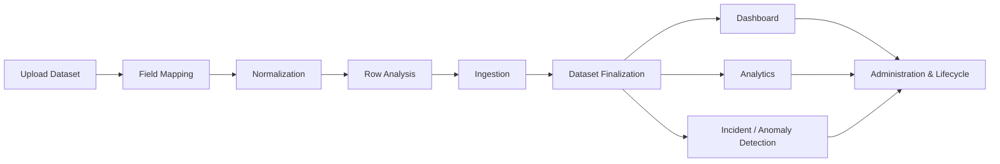
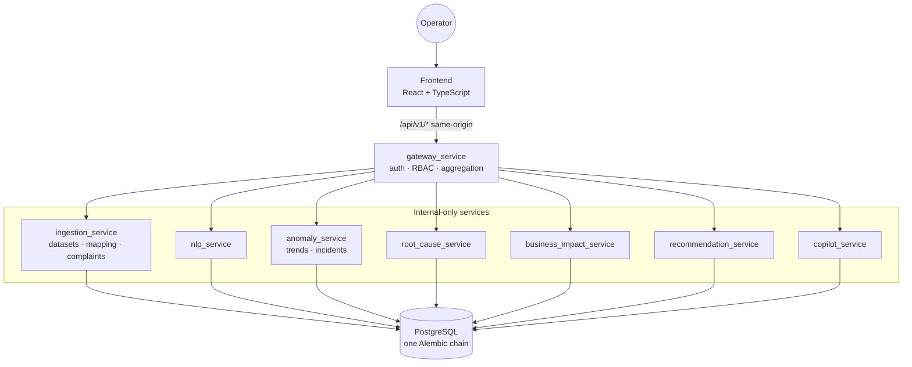

# Customer Experience Intelligence & Failure Detection Platform

A modular platform that turns raw customer complaints into explainable operational intelligence. It ingests complaint data, normalizes and maps it against known vocabulary, runs it through an operational anomaly-detection and root-cause pipeline scoped to a versioned dataset, and lets an operator act on the result — with every decision attributed to a real identity.

It is an engineering-focused prototype, not a deployed production service: the domain logic, persistence, authentication, and CI are real and independently verified (see [Validation](#validation)), but there is no live traffic, no cloud deployment, and no external customers. Where something is intentionally incomplete or deferred, this README says so directly rather than describing aspirational behavior as shipped.

---

## Why This Project Exists

Operational teams — e-commerce, logistics, fintech, SaaS — receive a continuous stream of customer complaints but have no systematic way to tell an isolated complaint from a real, spreading operational failure (a payment outage, a delivery-region breakdown, a support-quality regression) until it's already large. Turning unstructured complaint data into a trustworthy signal isn't a dashboarding problem — it requires a real pipeline: ingestion with correct field mapping, deterministic anomaly detection against a prior-window baseline, correlation into incidents, deterministic root-cause and business-impact reasoning, and recommendations that cite the evidence they came from.

## What the Platform Does

A user uploads a batch of complaint records into a **Dataset**. The platform maps each column to its known field vocabulary (asking for confirmation on anything unfamiliar), normalizes and deduplicates the rows, and ingests them with full source-file provenance. Finalizing a dataset version runs the whole intelligence pipeline against it — NLP enrichment, anomaly detection, incident correlation, root-cause analysis, business-impact scoring, and recommendation generation — all scoped to that one dataset, with no cross-dataset leakage. The Dashboard and Analytics workspaces then read from whichever dataset is currently selected, and an operator can review, confirm, or act on what the pipeline found.

## End-to-End Workflow



This is the implemented, working path through the product today. Field mapping, normalization, and row analysis happen client-side against the backend's own vocabulary before a row is ever submitted; ingestion, dataset finalization, and every downstream workspace call the Gateway directly.

## Key Capabilities

### Data Ingestion & Dataset Management
- Upload a CSV/JSON file (or add a record manually), preview parsed rows, and submit — with per-row success/duplicate/failure outcomes, not a silent bulk import.
- Field mapping against a real, enum-backed vocabulary, with unfamiliar values surfaced for an explicit mapping decision that is persisted and reused on future uploads.
- Source-hash duplicate detection at the database layer — re-uploading the same record is a real, safe no-op, not a duplicate row.
- Every complaint belongs to a real, isolated **Dataset**; extending a dataset creates a new, independently queryable **DatasetVersion** rather than overwriting history.
- Dataset archive / lifecycle status, with archived datasets protected from being selected or re-analyzed.

### Intelligence Pipeline
- NLP enrichment: sentiment, category, urgency, and keyword extraction (deterministic classifiers).
- Anomaly detection across volume, region, category, sentiment, and urgency, comparing each current time window against the prior equivalent window with fixed percentage-change thresholds — dataset-scoped, so unrelated datasets never contaminate each other's baseline.
- Incident correlation groups related anomalies into a single incident.
- Deterministic root-cause rule engine with a confirm/reject/refresh lifecycle.
- Weighted, five-dimension business-impact scoring (financial/customer/operational/SLA/reputation).
- An 8-rule recommendation engine generating prioritized, evidence-cited recommendations an operator can approve, reject, or defer — with the decision permanently attributed to a real, server-derived identity.

### Dashboard & Operational Visibility
- Reads the currently selected, finalized dataset and shows real operational counts and trends — never a global, unscoped view.
- An explicit "No dataset selected" state rather than an empty or fabricated chart.

### Analytics
- Category, regional, urgency, trend, and sentiment analysis, drawn 1:1 from the dataset's real trend data.
- Re-analysis and stale-state handling: extending a dataset re-runs analysis over its full cumulative record set, and the UI reflects which version's analysis is currently shown.

### Incident / Anomaly Detection
- Detected incidents are drillable into root cause, business impact, and recommendations, all keyed to the same evidence.
- A read-only Copilot interface is implemented with authenticated conversation ownership and an evidence/tool boundary; a live LLM provider is not currently configured.

### Administration & Dataset Lifecycle
- Real dataset lifecycle controls (create, finalize, archive, version history) and platform/service health.
- Intelligence configuration and platform operational state reflect real backend state.
- A few sections of Administration (broader user/role administration, external system integrations, a full audit trail) are illustrative content, clearly labeled as such in the UI — see [Current Scope](#current-scope-and-future-improvements).

## Architecture



Nine independently owned backend services sit behind `gateway_service`, the platform's sole public API boundary and identity owner. Every service persists to one shared PostgreSQL instance through its own local read model — never another service's ORM class. `ingestion_service` owns Dataset/DatasetVersion identity and complaint intake; every downstream service (`anomaly_service`, `root_cause_service`, `business_impact_service`, `recommendation_service`) requires a `dataset_id` on every write, and `anomaly_service`, `root_cause_service`, and `business_impact_service` require it on every read as well, so two datasets can never contaminate each other's analysis or query results through those services. `recommendation_service`'s by-id read (`GET /recommendations/{id}`) is a deliberate, ratified exception (AD-12 Addendum) rather than an oversight — a Recommendation stays addressable by its own id alone across a direct link or bookmark, with the frontend disclosing a dataset mismatch instead of blocking it. Full architecture rationale is in [`ARCHITECTURE.md`](ARCHITECTURE.md) and [`docs/DECISIONS.md`](docs/DECISIONS.md).

## Technology Stack

| Layer | Technology |
|---|---|
| Frontend | React 19, TypeScript, Vite, React Router |
| Backend | Python 3.11, FastAPI, SQLAlchemy, Alembic |
| Database | PostgreSQL 15, one linear migration chain across all services |
| Auth | Gateway-owned JWT session (HttpOnly cookie), bcrypt, role-based access control |
| Observability | Prometheus, Loki/Promtail, OpenTelemetry → Tempo, Grafana |
| Testing | pytest (backend), Vitest + Testing Library (frontend) |
| CI | GitHub Actions — backend tests, frontend lint/typecheck/test/build, Compose config validation |
| Infrastructure | Docker Compose (separate development and production-like configurations) |

## Repository Structure

```text
.
├── backend/
│   ├── migrations/            One linear Alembic chain, shared across all services
│   ├── services/               Nine independently owned services (gateway, ingestion, nlp,
│   │                            anomaly, root_cause, business_impact, recommendation, copilot, evaluation)
│   ├── shared/                 Cross-service config, logging, observability, constants
│   └── tooling/                Backup/restore, seed data, first-user bootstrap
├── frontend/
│   └── src/
│       ├── workspaces/          data (ingestion), dashboard, analytics, investigations,
│       │                        recommendations, administration
│       ├── shared/               Cross-workspace components, charts, primitives
│       └── app/                  Routing, providers, dataset context, API client
├── infrastructure/observability/  Prometheus, Loki, Promtail, OTel Collector, Tempo, Grafana config
├── docs/                        Architecture, decisions, changelog, validation report
├── docker-compose.yml           Development configuration
├── docker-compose.prod.yml      Production-like configuration
└── .env.example                 All required environment variables, documented
```

## Getting Started

**Prerequisites:** Docker and Docker Compose. (Python 3.11 / Node 20 only if you want to run something outside Docker.)

```bash
# 1. Configure environment
cp .env.example .env
# Set BOOTSTRAP_ADMIN_EMAIL / BOOTSTRAP_ADMIN_PASSWORD — no default on purpose.

# 2. Start the stack (backend services, frontend, Postgres, observability)
docker compose up --build

# 3. Run database migrations — not run automatically on container startup
docker compose exec gateway_service alembic upgrade head

# 4. Create the first user — there is no public registration endpoint
docker compose exec -e BOOTSTRAP_ADMIN_EMAIL=you@example.com -e BOOTSTRAP_ADMIN_PASSWORD='choose-a-real-password' \
  gateway_service python -m backend.tooling.seed_data.bootstrap_admin_user

# 5. Log in
# http://localhost:3000
```

Once logged in, the **Data** workspace (`/data`, first item in the sidebar) is the normal way to bring in complaint records: create a dataset, upload a CSV/JSON file (or add one manually), review the mapped/normalized rows, and ingest. Finalizing a dataset version runs the full intelligence pipeline against it.

For a larger sample dataset without going through the UI row-by-row:

```bash
docker cp datasets/sample_complaints/operational_seed.json oi_gateway:/tmp/operational_seed.json
docker compose exec gateway_service python backend/tooling/seed_data/load_sample_complaints.py --file /tmp/operational_seed.json
```

**Running tests locally:**

```bash
docker compose exec gateway_service pytest backend -q   # backend
cd frontend && npm test                                  # frontend
```

## Validation

The intelligence pipeline, authentication/RBAC, dataset isolation, and the full ingestion → dataset-finalization workflow have been manually walked through end-to-end against running services, in addition to the automated test suites (1,400+ backend tests, 380+ frontend tests, all passing in CI). A saved, evidence-labelled validation record covering the pipeline, dataset scoping, and known edge cases is in [`docs/VALIDATION_REPORT.md`](docs/VALIDATION_REPORT.md).

=======


## Current Scope and Future Improvements

The end-to-end workflow described above — upload, map, normalize, ingest, finalize, and see the result reflected in a dataset-scoped Dashboard, Analytics, and incident/anomaly pipeline — is implemented and working today.

The next iteration of the platform is expected to focus on:

- **Mapping edge cases** — refining "Keep as Others" and similar fallback behavior for values that don't cleanly match known vocabulary.
- **Historical record access** — easier browsing and correction of previously finalized/ingested records, beyond the current upload-forward flow.
- **Deeper intelligence quality** — richer anomaly correlation, recommendation reasoning, root-cause confidence, and business-impact scoring beyond the current deterministic rule sets.
- **No real LLM provider is configured** in this environment (`LLM_PROVIDER=none` by default) — Copilot's orchestration and tool-calling boundary are real and tested against the honest no-provider fallback, not a live model.
- **Further UX refinement** discovered during manual walkthroughs of the ingestion and dataset-lifecycle flows.
- Administration's dataset lifecycle, service health, and intelligence configuration sections show real data; broader capabilities like full SSO, external CRM integrations, and a complete audit trail remain illustrative and are labeled as such in the UI, pending real backend support.

## Documentation

| Document | Purpose |
|---|---|
| [`ARCHITECTURE.md`](ARCHITECTURE.md) | System design and service responsibilities |
| [`docs/DECISIONS.md`](docs/DECISIONS.md) | Architecture decision records |
| [`docs/PROJECT_STATUS.md`](docs/PROJECT_STATUS.md) | Current implementation status |
| [`docs/CHANGELOG.md`](docs/CHANGELOG.md) | Dated engineering changelog |
| [`docs/VALIDATION_REPORT.md`](docs/VALIDATION_REPORT.md) | End-to-end validation evidence |
| [`ROADMAP.md`](ROADMAP.md) | Forward-looking direction |

## License

No license file is currently present in this repository. All rights reserved by default until one is added.
