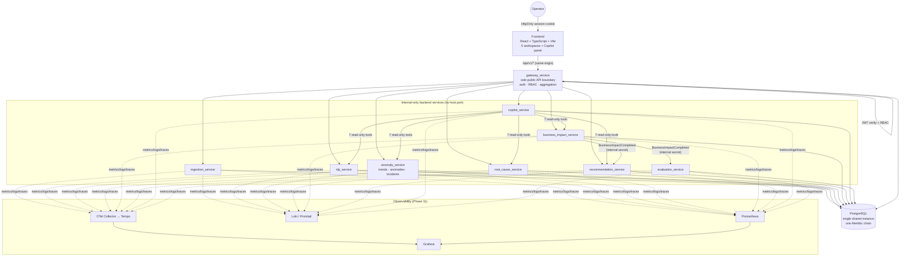

# Customer Experience Intelligence & Failure Detection Platform

A modular intelligence platform that turns raw customer complaints into explainable operational decisions. It ingests complaints, enriches them with NLP, detects anomalies and correlates them into incidents, determines root cause and business impact, generates recommendations, and lets an operator act on all of it — with attribution, role-based access control, and an evidence-grounded AI assistant layered on top.

It is an engineering-focused prototype, not a deployed production service: the domain logic, persistence, authentication, and CI are real and independently verified (see [Verification & Current Status](#verification--current-status)), but there is no live traffic, no cloud deployment, and no external customers. Where the system is intentionally incomplete or deferred, this document says so explicitly rather than describing aspirational behavior as shipped.

---

## Table of Contents

1. [Overview](#1-overview)
2. [Key Capabilities](#2-key-capabilities)
3. [System Architecture](#3-system-architecture)
4. [Architecture Principles](#4-architecture-principles)
5. [Repository Structure](#5-repository-structure)
6. [Getting Started](#6-getting-started)
7. [Authentication & Authorization](#7-authentication--authorization)
8. [Database & Migrations](#8-database--migrations)
9. [Backup & Restore](#9-backup--restore)
10. [Observability](#10-observability)
11. [Continuous Integration](#11-continuous-integration)
12. [Testing](#12-testing)
13. [Docker: Development vs. Production-Like](#13-docker-development-vs-production-like)
14. [Known Limitations](#14-known-limitations)
15. [Documentation Index](#15-documentation-index)

---

## 1. Overview

**Business problem:** operational teams receive a continuous stream of customer complaints but have no systematic way to tell an isolated complaint from a real, spreading operational failure — a payment outage, a delivery-region breakdown, a support-quality regression — until it's already large.

**Technical problem:** turning unstructured complaint text into a trustworthy, explainable signal requires a real pipeline, not a dashboard: enrichment, statistical anomaly detection, correlation into incidents, deterministic root-cause and business-impact reasoning, and recommendation generation — each stage auditable back to the evidence that produced it.

**What this platform does, concretely:** a complaint is ingested → enriched with sentiment/category/urgency/keywords (NLP) → compared against a rolling baseline for volume/region/category/sentiment/urgency anomalies → correlated with related anomalies into an incident → matched against a deterministic root-cause rule set → scored for business impact across five weighted dimensions → used to generate a prioritized recommendation, which an operator can approve/reject/defer with the decision permanently attributed to their identity. A Gateway aggregates all of this into five frontend workspaces (Dashboard, Investigations, Recommendations, Analytics, Administration), and a read-only Copilot lets an operator ask natural-language questions grounded in the same real evidence.

**What makes it technically interesting:** every stage is a real, independently-owned backend service with its own persistence and tests (not a monolith with feature flags); the recommendation-decision attribution is provably spoof-proof (a Gateway-attested header only, never client input, verified by a dedicated test); Copilot's seven tools are structurally — not just conventionally — read-only, enforced by a client that exposes no mutating HTTP verb at all; and the project's own CI and closure work were built to surface real defects (a genuine fresh-database migration bug) rather than hide them behind a workaround.

---

## 2. Key Capabilities

| Capability | What it does | Status |
|---|---|---|
| Complaint ingestion | Validated intake, source-hash deduplication | ✅ Implemented |
| NLP enrichment | Sentiment, category, urgency, keyword extraction (deterministic classifiers) | ✅ Implemented |
| Anomaly detection | Volume/region/category/sentiment/urgency deviation against a rolling baseline window | ✅ Implemented |
| Incident correlation | Groups related anomalies into a single incident | ✅ Implemented |
| Root cause analysis | Deterministic rule engine (5 rules) with a confirm/reject/refresh lifecycle | ✅ Implemented (service-level; lifecycle mutation routes are not yet Gateway-exposed) |
| Business impact scoring | Weighted 5-dimension score (financial/customer/operational/SLA/reputation) | ✅ Implemented |
| Recommendation engine | 8-rule deterministic engine generating prioritized, evidence-cited recommendations | ✅ Implemented |
| Recommendation decisions | Approve/reject/defer/pending, with a note | ✅ Implemented |
| Decision attribution & history | `decided_by` + an append-only `recommendation_decision_history` table, populated only from a Gateway-attested identity, never client input | ✅ Implemented, verified spoof-proof |
| Authentication | Gateway-owned JWT session in an HttpOnly, `SameSite=Lax` cookie; bcrypt password hashing | ✅ Implemented |
| First-user bootstrap | Controlled operator-invoked script — no public registration, no default credentials | ✅ Implemented |
| RBAC | `viewer` / `operator` / `admin`, enforced on every Gateway route | ✅ Implemented |
| Internal service trust | Shared-secret header on internal mutation routes; Gateway-attested principal propagation | ✅ Implemented |
| Copilot | Natural-language Q&A over real evidence via 7 structurally read-only tools, bounded LangGraph orchestration | ✅ Implemented — see [Copilot honesty note](#3-system-architecture) below |
| Copilot conversation ownership | Per-user conversation isolation + owner-only delete | ✅ Implemented |
| Investigation aggregation | Gateway composes incident/root-cause/business-impact/recommendation/NLP evidence, in parallel | ✅ Implemented |
| Observability | Structured logs, correlation IDs, Prometheus metrics, OpenTelemetry tracing, 2 Grafana dashboards | ✅ Implemented |
| Backup & restore | Real `pg_dump`/`pg_restore` round-trip, isolated-container verification | ✅ Implemented |
| CI | GitHub Actions: backend tests, frontend lint/typecheck/test/build, Compose config validation | ✅ Implemented |
| Role-aware frontend UI | Hiding controls a user's role can't use | 🔶 Planned / not yet implemented — backend RBAC is authoritative and enforced regardless |
| Real LLM provider | An actual language model behind Copilot | 🔶 Not configured in this environment — see below |
| Twelve-stage synthetic validation report | A saved, end-to-end validation artifact across all stages including auth | 🔶 Planned / not yet produced |

---

## 3. System Architecture



**Copilot honesty note:** no real LLM provider is configured in this environment (`LLM_PROVIDER=none` by default). Copilot's architecture, orchestration, tool-calling boundary, and conversation persistence are all real and independently tested — but every verification of its behavior in this repository exercises the honest `NullLLMProvider` fallback ("no language model is configured") or a deterministic `ScriptedLLMProvider` in its evaluation harness, never a live model's judgment. This is disclosed here on purpose, not discovered by a reader later.

**`evaluation_service`** is an independent, out-of-band intelligence-assurance observer (Phase 8) — it consumes `BusinessImpactCompleted` events and computes real quality/explainability scores, but it is architecturally never a blocking step in the pipeline above, and (honestly) nothing in the current Gateway or frontend surfaces its output to a user yet.

---

## 4. Architecture Principles

- **Gateway-owned identity.** `gateway_service` is the platform's only public API boundary and its only new persistence responsibility as of Phase 13 — `users`/`roles`/`user_roles` live nowhere else.
- **Same-origin HttpOnly JWT session.** No cross-origin cookie complexity: the frontend and Gateway are same-origin (Vite dev proxy in development, an equivalent path in the production-like configuration), so the session cookie can be `HttpOnly` + `SameSite=Lax` without a `SameSite=None`/HTTPS-everywhere requirement.
- **RBAC at the Gateway, not the UI.** Every Gateway route enforces `viewer`/`operator`/`admin` server-side; frontend visibility is advisory only, never the authorization boundary.
- **Internal trust is explicit, not implicit.** The two genuine internal mutation boundaries (`business_impact_service → recommendation_service` / `evaluation_service`) require a shared-secret header; read-only aggregation calls rely on network topology alone (no backend service publishes a host port).
- **Attribution is server-derived, never client-supplied.** `decided_by` on a recommendation decision and `owner_id` on a Copilot conversation are populated exclusively from a Gateway-attested identity header — a client cannot spoof either, and this is enforced by tests, not just convention.
- **PostgreSQL is the one system of record.** One shared instance, one linear Alembic migration chain, no per-service database, no ORM coupling across service boundaries (a service reads another service's already-persisted data through its own local read model, never by importing that service's ORM class).
- **Docker dev/prod-like separation.** `docker-compose.yml` (development: bind mounts, hot reload, Vite dev server) and `docker-compose.prod.yml` (production-like: multi-stage frontend build served by nginx, no source bind mounts, network segmentation, PostgreSQL not host-published) are deliberately separate files so neither compromises the other.
- **Observability is reused, not reinvented.** Phase 11's structured logging, correlation IDs, Prometheus, and tracing stack are the same infrastructure every later phase's auth/RBAC/Copilot events flow through — no parallel telemetry system was introduced.
- **Backup/restore is safe by construction.** The restore-verification tool refuses, by a hard-coded guard checked before any Docker command runs, to ever target the real development database container.

Full architecture decision records — including the six original Phase 13 decisions (AD-1–AD-6) and the two closure-phase decisions (AD-7, the corrective-migration mechanism; AD-8, the bootstrap mechanism) — are in [`docs/DECISIONS.md`](docs/DECISIONS.md). The frozen Phase 13 architecture itself is [`docs/architecture/phase-13/PHASE_13_ARCHITECTURE.md`](docs/architecture/phase-13/PHASE_13_ARCHITECTURE.md).

---

## 5. Repository Structure

```text
.
├── backend/
│   ├── migrations/            # One linear Alembic chain (17 revisions), shared across all services
│   ├── services/
│   │   ├── gateway_service/       # Public API boundary: auth, RBAC, aggregation (port 8000)
│   │   ├── ingestion_service/     # Complaint intake (8001)
│   │   ├── nlp_service/           # Sentiment/category/urgency/keyword enrichment (8002)
│   │   ├── anomaly_service/       # Trends, anomaly detection, incident correlation (8003)
│   │   ├── root_cause_service/    # Deterministic root-cause rule engine (8004)
│   │   ├── business_impact_service/ # Weighted business-impact scoring (8005)
│   │   ├── recommendation_service/  # Recommendation engine + decision attribution/history (8006)
│   │   ├── copilot_service/       # Read-only AI assistant (8007)
│   │   └── evaluation_service/    # Out-of-band intelligence quality assurance (8008)
│   ├── shared/                # Cross-service config, logging, observability, security, constants
│   └── tooling/
│       ├── backup_restore/        # pg_dump/pg_restore + isolated-container restore verification
│       └── seed_data/             # Sample-complaint loader; first-user bootstrap script
├── frontend/
│   └── src/
│       ├── auth/               # Login page, session context, route guard
│       ├── workspaces/          # dashboard, investigations, recommendations, analytics, administration
│       ├── copilot/             # Copilot panel, API client, context
│       └── shared/              # Cross-workspace components, API client
├── infrastructure/observability/  # Prometheus, Loki, Promtail, OTel Collector, Tempo, Grafana config
├── datasets/                  # Sample/seed complaint data, validation dataset generator
├── docs/                      # Architecture, decisions, phase-by-phase status
├── .github/workflows/ci.yml   # GitHub Actions CI
├── docker-compose.yml         # Development configuration
├── docker-compose.prod.yml    # Production-like configuration (AD-2)
└── .env.example                # All required environment variables, documented
```

---

## 6. Getting Started

### Prerequisites

- Docker and Docker Compose
- (Optional, for running things outside Docker) Python 3.11 and Node 20

### 1. Configure environment

```bash
cp .env.example .env
```

Review `.env` and, at minimum, set `BOOTSTRAP_ADMIN_EMAIL` / `BOOTSTRAP_ADMIN_PASSWORD` (see [step 4](#4-create-the-first-user) below) — these have no default value on purpose (AD-8).

### 2. Start the stack

```bash
docker compose up --build
```

This starts all 17 Compose services: the 9 backend services, the frontend, PostgreSQL, and the Phase 11 observability stack (Prometheus, Loki, Promtail, OTel Collector, Tempo, Grafana).

### 3. Run database migrations

Migrations are **not** run automatically by any container's startup command — this is a deliberate boundary (schema changes are an explicit, operator-invoked action, not an application-startup side effect):

```bash
docker compose exec gateway_service alembic upgrade head
```

### 4. Create the first user

There is no public registration endpoint. The platform's first login is created by a controlled, operator-invoked bootstrap script ([AD-8](docs/DECISIONS.md)) — safe to re-run, never overwrites an existing user's password:

```bash
docker compose exec -e BOOTSTRAP_ADMIN_EMAIL=you@example.com -e BOOTSTRAP_ADMIN_PASSWORD='choose-a-real-password' \
  gateway_service python -m backend.tooling.seed_data.bootstrap_admin_user
```

### 5. Log in

Open `http://localhost:3000` and log in with the credentials from step 4. The frontend proxies `/api` to the Gateway same-origin in development (`vite.config.ts`).

### Sample data (optional)

```bash
docker compose exec gateway_service python backend/tooling/seed_data/load_sample_complaints.py
```

---

## 7. Authentication & Authorization

- **Session model:** `POST /api/v1/auth/login` verifies a bcrypt password hash and issues a JWT in an `HttpOnly`, `SameSite=Lax` cookie (`Secure` outside local development). No refresh token exists — a session lasts until the JWT's own expiry, after which the user logs in again.
- **`GET /api/v1/auth/me`** returns the current identity (`userId`, `email`, `roles`) for a valid session.
- **`POST /api/v1/auth/logout`** clears the cookie. There is no server-side token blocklist — a stolen token remains valid until its natural expiry even after logout, a deliberate, documented tradeoff (short token lifetime is the primary defense) rather than an oversight.
- **Roles:** `viewer` (read-only), `operator` (viewer + recording a recommendation decision + Copilot), `admin` (reserved for future administrative capability — honestly, no route exercises anything exclusive to `admin` today). Enforced on all 12 Gateway routes via a `require_role` dependency; a 403 can only ever follow a genuinely valid session (401 is structurally guaranteed to be checked first).
- **First-user bootstrap:** see [Getting Started](#4-create-the-first-user) — `backend/tooling/seed_data/bootstrap_admin_user.py`. Never a public endpoint, never invoked by application startup, idempotent, never overwrites an existing password.
- **Internal service trust:** the two genuine internal mutation routes (`business_impact_service → recommendation_service`/`evaluation_service`) require a shared-secret header (`X-Internal-Secret`); recommendation-decision attribution and Copilot conversation ownership are populated from a separate Gateway-attested principal header, never from client-supplied request data.

---

## 8. Database & Migrations

- **PostgreSQL 15**, one shared instance, one linear Alembic migration chain (17 revisions, no branches) under `backend/migrations/versions/`.
- **Identity:** `users`, `roles` (seeded: `viewer`/`operator`/`admin`), `user_roles`.
- **Recommendation attribution:** `recommendations.decided_by` (FK → `users.id`, populated only from the Gateway-attested identity) and an append-only `recommendation_decision_history` table, written in the same transaction as the current-state update — the two cannot diverge.
- **Copilot:** `copilot_conversations` (with `owner_id`), `copilot_messages`.
- A fresh, genuinely empty database migrates cleanly end-to-end via `alembic upgrade head` — this was a real, previously-broken case (a PostgreSQL enum-creation-order defect in a historical migration) fixed and directly verified against three independent fresh databases as part of Phase 13 closure ([AD-7](docs/DECISIONS.md)).

---

## 9. Backup & Restore

`backend/tooling/backup_restore/`:

```bash
python -m backend.tooling.backup_restore.backup
python -m backend.tooling.backup_restore.restore_verify backups/<file>.dump
```

- `backup.py` runs a real `pg_dump -Fc` against the running Postgres container; a failed dump's partial file is deleted, never left looking valid.
- `restore_verify.py` restores into an isolated, throwaway container (never the real development database — refused by a hard-coded guard checked before any Docker command runs) and runs row-count/orphan-FK integrity checks covering every identity and attribution table.
- Backups are written to `backups/`, which is git-ignored.

---

## 10. Observability

All 9 backend services emit structured JSON logs (allowlist-based field redaction — nothing is logged unless explicitly listed safe), participate in `X-Request-ID` correlation, expose Prometheus metrics, and are instrumented with OpenTelemetry tracing (exported to Tempo). Grafana ships with two dashboards (Platform Health; API & Service Performance). Every scrape target and datasource is addressed by Compose service name — verified by a dedicated test, not just convention.

---

## 11. Continuous Integration

`.github/workflows/ci.yml` — GitHub Actions, three jobs:

| Job | What it does |
|---|---|
| `backend-tests` | Real Postgres 15 service container → `alembic upgrade head` → `pytest backend -q` |
| `frontend-checks` | `npm ci` → `eslint` → `tsc -b --noEmit` → `vitest run` → `npm run build` |
| `compose-validate` | `docker compose config` for both the development and production-like Compose files |

No step hides a failure behind `continue-on-error` or a suppressed exit code.

---

## 12. Testing

- **Backend:** `pytest backend -q` — 1,220+ tests across all 9 services and shared modules, 0 failures on a freshly migrated database (a subset of tests that require a directly-reachable local Postgres skip cleanly when one isn't available, a documented, pre-existing convention — CI itself always has one).
- **Frontend:** `npm test` (Vitest) — 337 tests across 48 files, covering all five workspaces, authentication, and Copilot.
- Run locally: `docker compose exec gateway_service pytest backend -q` (backend) and `npm test` from `frontend/` (frontend).

---

## 13. Docker: Development vs. Production-Like

| | `docker-compose.yml` (development) | `docker-compose.prod.yml` (production-like prototype configuration) |
|---|---|---|
| Frontend | Vite dev server, hot reload | Multi-stage build, served by nginx |
| Backend source | Bind-mounted, `--reload` | Baked into the image, no bind mount |
| PostgreSQL | Host-published (`5432`) | Not host-published |
| Network | Flat | Segmented (`public`: gateway + frontend; `internal`: everything else) |
| Containers | Root where convenient | Non-root (`appuser`) |

Both represent the same 17-service topology — the production-like configuration changes only *how* services are built and run, never *what* the platform does. It is a **production-like prototype configuration**, not an actual production deployment: there is no cloud infrastructure, no managed database, no external ingress, and no rotated real secrets behind it.

---

## 14. Known Limitations

Documented honestly, not discovered later:

- **No real LLM provider is configured.** Copilot's fallback and orchestration behavior are real and tested; live-model reasoning has never been exercised in this environment.
- **Root-cause confirm/reject/refresh** exists and works at the service layer but is not yet exposed through the Gateway or Copilot.
- **Role-aware frontend UI** does not yet exist — the backend RBAC boundary is authoritative and enforced regardless, but a `viewer`-role user currently sees controls they don't have permission to use before a 403 explains why.
- **Administration workspace**: two of six sections (Platform Overview, Intelligence Configuration) show real data; the remainder are illustrative placeholders, self-labeled as such in code.
- **`evaluation_service`'s output** is computed and persisted but not yet surfaced by any Gateway route, dashboard, or Copilot tool.
- **A twelve-stage, saved synthetic-data validation report** (covering ingestion through authentication/authorization end-to-end) has not yet been produced.
- **`ingestion_service`** has no dedicated automated test suite yet, unlike its sibling services.

These are tracked, scoped closure items, not undisclosed gaps.

---

## 15. Documentation Index

| Document | Purpose |
|---|---|
| [docs/architecture/phase-13/PHASE_13_ARCHITECTURE.md](docs/architecture/phase-13/PHASE_13_ARCHITECTURE.md) | Frozen Phase 13 architecture (identity, auth, RBAC, internal trust, attribution, ownership, backup/restore, CI, Docker hardening) |
| [docs/DECISIONS.md](docs/DECISIONS.md) | Full architecture decision records, AD-1 through AD-8 |
| [docs/PROJECT_STATUS.md](docs/PROJECT_STATUS.md) | Phase-by-phase implementation status |
| [ARCHITECTURE.md](ARCHITECTURE.md) | System design and service responsibilities |
| [REPOSITORY_STRUCTURE.md](REPOSITORY_STRUCTURE.md) | Directory conventions and engineering standards |
| [PRD.md](PRD.md) | Product requirements |
| [PRODUCT_EXPERIENCE_GUIDE.md](PRODUCT_EXPERIENCE_GUIDE.md) | Product/UX principles |
| [ROADMAP.md](ROADMAP.md) | Development roadmap |
| [PROJECT_BRAIN.md](PROJECT_BRAIN.md) | Engineering context and history |
