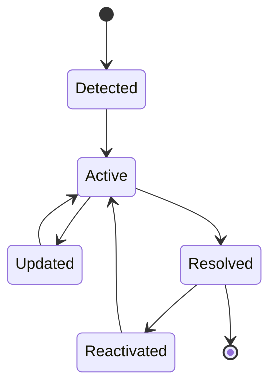
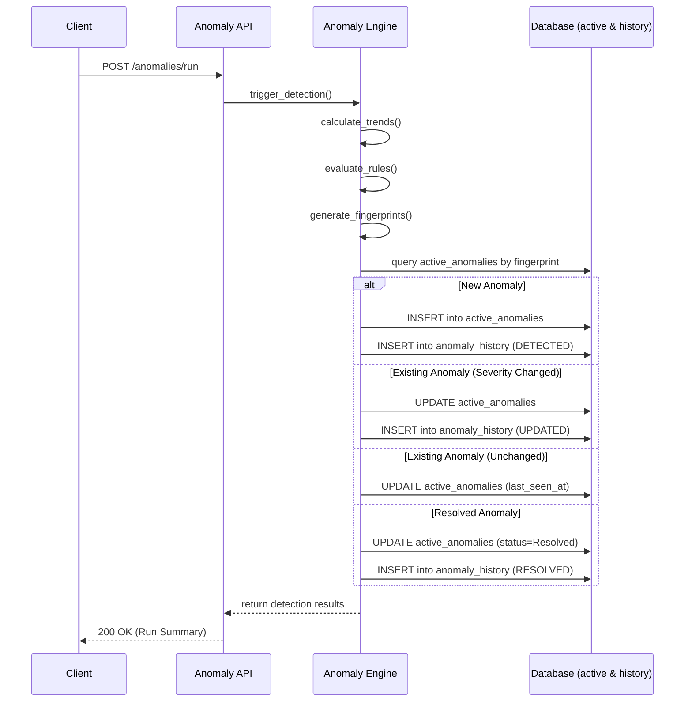

# Architecture Decision Records (ADR)

Project: Customer Experience Intelligence & Failure Detection Platform

## Purpose

This document records significant architectural and engineering decisions made during the development of the platform.

It captures **why** decisions were made, not implementation details. Routine bug fixes, refactoring, and feature additions should be tracked in the changelog instead.

---

## ARCH-001 — Modular Service-Based Architecture

**Status:** Accepted

**Date:** 2026-07-19

### Context

The platform consists of multiple intelligence capabilities including complaint ingestion, NLP enrichment, anomaly detection, root cause analysis, business impact estimation, recommendation generation, and an AI copilot.

### Decision

Adopt a modular service-based architecture within a shared monorepo. Each service owns a specific intelligence responsibility while sharing common infrastructure, utilities, and database patterns.

### Rationale

- Clear separation of concerns.
- Easier independent development and testing.
- Future migration to independently deployable services if required.
- Avoids premature distributed-system complexity.

### Consequences

**Pros**

- High maintainability.
- Clear ownership boundaries.
- Scalable project structure.

**Cons**

- Slight duplication between services.
- Additional coordination required between service interfaces.

---

## ARCH-002 — Shared PostgreSQL Database for MVP

**Status:** Accepted

**Date:** 2026-07-19

### Context

Early MVP development prioritizes engineering simplicity and rapid iteration over distributed persistence.

### Decision

Use a shared PostgreSQL database accessed through SQLAlchemy while maintaining logical service ownership of entities.

### Rationale

- Simplifies development.
- Reduces infrastructure complexity.
- Enables analytics across intelligence stages.
- Supports future migration if required.

### Consequences

**Pros**

- Faster development.
- Easier debugging.
- Simpler deployment.

**Cons**

- Services are logically isolated rather than physically isolated.

---

## ARCH-003 — Service Independence Between Ingestion and NLP

**Status:** Accepted

**Date:** 2026-07-19

### Context

The NLP service enriches complaint records created by the ingestion service.

### Decision

The `ComplaintEnrichment` entity stores only `complaint_id` and does not define an ORM relationship to the `Complaint` model.

### Rationale

- Maintains service independence.
- Prevents SQLAlchemy mapper coupling.
- Simplifies future service separation.

### Consequences

**Pros**

- Cleaner architecture.
- Easier testing.
- Stable mapper initialization.

**Cons**

- Complaint details must be explicitly queried when required.

---

## ARCH-004 — Deterministic NLP for MVP

**Status:** Accepted

**Date:** 2026-07-19

### Context

The roadmap targets explainable operational intelligence before introducing advanced AI models.

### Decision

Implement the initial NLP pipeline using deterministic rules and keyword-based classification instead of machine learning models.

### Rationale

- Fully explainable outputs.
- Faster implementation.
- Easier debugging.
- Stable and reproducible behavior.

### Consequences

**Pros**

- Transparent decision-making.
- No model training required.
- Predictable results.

**Cons**

- Lower linguistic flexibility.
- Less accurate than modern ML models on complex text.

---

## DATA-001 — Database-Level Referential Integrity Across Service Boundaries

**Status:** Accepted

**Date:** 2026-07-19

### Context

The platform adopts a modular architecture where the NLP service needs to enrich complaint records created by the Ingestion service, but without creating tightly coupled ORM models.

### Decision

The `ComplaintEnrichment` entity stores the `complaint_id` without an ORM `ForeignKey`. Referential integrity is enforced strictly by PostgreSQL database migrations, while each service owns only its own ORM models.

### Rationale

- Ensures data integrity without coupling Python model dependencies.
- Services do not have to share SQLAlchemy mappers.
- Facilitates future decoupling into separate databases if needed.

### Consequences

**Pros**

- Database-level safety.
- Decoupled ORM definitions.
- True service independence while maintaining data integrity.

**Cons**

- Requires careful management of raw database migrations.
- SQLAlchemy cannot automatically traverse relationships via `.complaint`.

---

## DATA-002 — Service-Local Read Models

**Status:** Accepted

**Date:** 2026-07-19

### Problem

Some services legitimately need to read data owned by another service — for example, the Anomaly Service's Trend Engine must read `complaints` and `complaint_enrichments`, owned by the Ingestion and NLP services respectively. Importing another service's SQLAlchemy ORM model class to do this reintroduces the same class of problem seen in Phase 4: SQLAlchemy mapper/metadata coupling, fragile startup behavior, and a hard Python-level dependency between services that are supposed to remain independently deployable.

### Decision

- Backend services must never import ORM models owned by another service.
- Each service defines its own minimal SQLAlchemy Core read models when direct database access to another service's tables is required.
- Read models exist only for querying already-persisted, shared data — they are not used for writes and carry no business logic.
- Business ownership of an entity (schema, migrations, write access) remains exclusively within the owning service, regardless of how many other services read from it.

### Rationale

- Prevents SQLAlchemy metadata coupling between services — the root cause of the Phase 4 mapper-initialization failure.
- Preserves service autonomy: any service can be developed, tested, and deployed without importing another service's Python package.
- Keeps read access explicit and minimal — a service declares exactly the columns it needs, nothing more.
- Generalizes the precedent set by ARCH-003 and DATA-001 (the NLP/Complaint relationship removal) into a platform-wide engineering standard rather than a one-off fix.

### Consequences

**Pros**

- No cross-service ORM class imports, ever.
- Each service's mapper configuration is fully self-contained and cannot be broken by another service's schema changes.
- Read models are cheap to write and easy to audit — a handful of `Column` declarations on a dedicated `MetaData` instance.

**Cons**

- Column definitions for a shared table may be duplicated, in reduced form, across every service that reads it.
- If the owning service changes a column's type or name, every dependent service's read model must be updated manually — there is no shared source of truth beyond the migration history.

---

## ANOMALY-001 — Hybrid Anomaly Lifecycle Management

**Status:** Accepted

**Date:** 2026-07-20

### Problem

The Anomaly Detection Engine needs a persistence strategy to store detected anomalies. Pure snapshot persistence (storing every anomaly on every run) leads to unbounded database growth and massive duplication, creating performance bottlenecks for simple dashboard queries. Conversely, latest-state-only persistence (overwriting existing anomalies) destroys the timeline, making future Root Cause Analysis (RCA) and Business Impact Analysis impossible.

### Alternatives Considered

1. **Pure Snapshot Persistence (Event Sourcing):** Create a new record for every detected anomaly during every run. (Rejected due to database bloat and slow querying for current state).
2. **Latest-State-Only Persistence (CRUD):** Update the anomaly in place, losing historical progression. (Rejected due to inability to support RCA and Explainability).
3. **Hybrid Approach:** Maintain an active state table for fast operational querying and an append-only timeline table for state changes. (Chosen).

### Decision

Implement a hybrid persistence architecture using two tables:
- `active_anomalies`: A mutable table representing the current state of ongoing issues (fast operational lookups).
- `anomaly_history`: An append-only ledger tracking lifecycle state changes (e.g., detection, severity updates, resolution) for historical RCA.

### Rationale

This approach provides O(1) operational dashboarding by querying only the active anomalies, while perfectly preserving the timeline context required by the future AI Copilot and Root Cause engines without storing redundant data. 

### Consequences

**Pros**
- Zero data bloat (snapshots are only created on state changes).
- Fast UI rendering (Dashboard only queries `active_anomalies`).
- Full auditability and perfect RCA integration (Timeline is preserved in `anomaly_history`).

**Cons**
- Requires more complex persistence logic to calculate state deltas during the detection run.

### Anomaly Lifecycle State Machine

The following diagram illustrates the anomaly lifecycle:

### Execution Flow

The sequence of the hybrid persistence model during a detection run:

---

## ANOMALY-002 — Fingerprint-Based Anomaly Identity

**Status:** Accepted

**Date:** 2026-07-20

### Purpose of Fingerprints

To reliably match a newly detected anomaly from the current run against an existing active anomaly in the database, the system requires a deterministic, stable identifier.

### Decision

Implement a stable anomaly identity using a deterministic SHA-256 hash (fingerprint) of the anomaly's core dimensions (e.g., `detector_type`, `dimension_value`). 

### Rationale

- **Stable Anomaly Identity:** An anomaly maintains the exact same ID across multiple engine executions as long as the underlying dimensional issue persists.
- **Duplicate Prevention:** The database enforces a unique constraint on the fingerprint for active anomalies, guaranteeing that the same issue is never double-counted.
- **Reactivation Behavior:** If a previously resolved anomaly resurfaces with the same fingerprint, it can be seamlessly reactivated and linked to its historical timeline.
- **Future Extensibility:** The fingerprinting logic is centralized. If new dimensions are added in the future, the hashing algorithm can be versioned to prevent breaking existing historical fingerprints.

---

## INCIDENT-001 — Incident-Centric Correlation Model

**Status:** Accepted

**Date:** 2026-07-20

### Problem

As the Anomaly Detection Engine scales, it will detect multiple related anomalies across different dimensions (e.g., a spike in "Login Failures" and a spike in "Authentication Errors" in the same region at the same time). If these individual anomalies are fed directly into the future Root Cause Analysis engine, it will create redundant RCA workflows and noise.

### Alternatives Considered

1. **Direct Anomaly RCA:** Send every anomaly independently to the Root Cause Engine. (Rejected due to noise and redundant causal evaluations).
2. **Incident-Centric Correlation (Chosen):** Introduce a logical grouping layer (Incident Correlation) at the end of Phase 5. This engine evaluates active anomalies and clusters related ones into unified "Incidents". 

### Decision

Implement an Incident Correlation Engine as the final step of Phase 5. This engine serves as the transition point between detection and causation. Anomalies are grouped into Incidents based on temporal, regional, and categorical proximity. The Root Cause Engine (Phase 6) will investigate *Incidents*, not individual anomalies.

### Rationale

- **Noise Reduction:** Operators and AI Copilots receive a unified incident report rather than dozens of redundant anomaly alerts.
- **Clearer Causation:** Investigating a cluster of related anomalies provides a stronger signal for the Root Cause Engine than investigating them in isolation.
- **Separation of Concerns:** Phase 5 is fully responsible for "What is happening?" (Trend -> Anomaly -> Incident), leaving Phase 6 entirely focused on "Why is it happening?" (Root Cause).

### Consequences

**Pros**
- Cleaner RCA architecture.
- Better operational dashboarding (focusing on Incidents rather than noisy anomalies).
- Highly structured data model preparing for Phase 6.

**Cons**
- Requires correlation logic and an additional schema entity (`Incident`) to track the groups.

---

## RCA-001 — Persistence-Independent Domain Input Model

**Status:** Accepted

**Date:** 2026-07-21

### Context

Root Cause Analysis (Phase 6) must consume `Incidents` generated by the Incident Correlation Engine (Phase 5). Importing Incident ORM models from the Anomaly Service into the Root Cause Service violates DATA-002 (Service-Local Read Models) and creates tight cross-service coupling.

### Decision

Introduce a persistence-independent `Incident` domain model (`domain/incident.py`) dedicated purely to Root Cause inference. This is a plain, immutable dataclass containing only the information required for rule evaluation.

### Rationale

- **Service Independence:** The Root Cause Engine does not depend on the internal database schema or ORM models of another service.
- **No ORM Coupling:** Avoids SQLAlchemy mapper initialization issues and dependency leakage.
- **Pure Domain Logic:** Keeps the Root Cause Engine purely functional, deterministic, and isolated.
- **Easier Testing:** The engine can be tested with plain dataclasses without requiring a database session.
- **Future Portability:** A completely isolated domain engine can be easily moved or scaled if needed.

### Consequences

**Pros**
- Fully isolated domain engine.
- Independent, fast, database-less unit testing.
- No SQLAlchemy dependencies inside the engine logic.
- Stable, predictable architecture.

**Cons**
- Requires mapping from persisted Incident entities in Step 2 before passing them into the engine.
- Small duplication of field definitions (Incident attributes exist in both the Phase 5 ORM and Phase 6 Domain).

---

## BI-001 — Business Impact Uses Deterministic Rules

**Status:** Accepted

**Date:** 2026-07-22

### Context

Phase 7 Step 1 must evaluate the business consequences of an Incident and its identified Root Cause. The platform's core principle is explainability-first: every output consumed by the AI Copilot must be fully auditable and reproducible without dependency on probabilistic models.

### Decision

The Business Impact Analysis Engine evaluates all five impact dimensions (Financial, Customer, Operational, SLA, Reputation) using deterministic, threshold-based rules. No machine learning, probabilistic scoring, or AI inference is used.

### Rationale

- **Explainability:** Every impact level can be traced to the exact rule condition and input value that triggered it.
- **Auditability:** Outputs are fully reproducible for any given set of inputs, enabling reliable regression testing.
- **Reliability:** Deterministic rules do not degrade over time or require retraining.
- **AI-Safe:** The AI Copilot downstream can safely consume the output knowing it was produced by auditable, transparent logic.

### Consequences

**Pros**
- Fully explainable and auditable impact assessments.
- Predictable, reproducible behavior across all environments.
- No model training, deployment, or versioning overhead.

**Cons**
- Rule thresholds require manual review and tuning as business conditions evolve.

---

## BI-002 — Independent ImpactRule Abstraction

**Status:** Accepted

**Date:** 2026-07-22

### Context

The Business Impact Engine must evaluate five distinct business dimensions. Each dimension has independent logic, thresholds, and escalation conditions. Coupling dimension logic within a single class or function would violate the Single Responsibility Principle and make isolated testing impossible.

### Decision

Define an `ImpactRule` abstract base class in the domain layer. Each of the five business dimensions is implemented as an independent, concrete rule class that implements this interface. No rule has knowledge of any other rule.

### Rationale

- **Single Responsibility:** Each rule class owns exactly one dimension's evaluation logic.
- **Isolated Testing:** Every rule can be unit-tested independently with no dependency on the engine or other rules.
- **Clarity:** The boundary between evaluation logic (rules) and orchestration logic (engine) is explicit.

### Consequences

**Pros**
- Independent development and testing of each dimension's rule.
- Adding a new rule requires no changes to existing rules.
- Rule logic is self-contained and easily reviewable.

**Cons**
- Requires a small number of parallel rule class definitions rather than a single conditional block.

---

## BI-003 — BusinessImpactEngine Orchestrates Injected ImpactRule Implementations

**Status:** Accepted

**Date:** 2026-07-22

### Context

The Business Impact Engine needs to coordinate the evaluation of all five business dimensions and assemble the final `BusinessImpactAssessment`. The engine must remain open for extension (new rules) without requiring modification, and must depend on the abstraction rather than concrete rule implementations.

### Decision

`BusinessImpactEngine` accepts a `Sequence[ImpactRule]` at construction time. It iterates over the injected rules, dispatches each evaluation, assembles the `BusinessImpactProfile`, and delegates to `scoring.py`, `weighting.py`, and `explanation.py` for the final assessment. A `default_rules()` factory in the same module provides the standard five-rule configuration.

### Rationale

- **Dependency Inversion:** The engine depends on the `ImpactRule` abstraction, never on concrete rule classes.
- **Open/Closed:** New rules can be injected without modifying the engine.
- **Testability:** The engine can be tested with any mock or stub implementation of `ImpactRule`.
- **Explicit Configuration:** The `default_rules()` factory makes the standard configuration discoverable without hiding it inside the engine constructor.

### Consequences

**Pros**
- Engine logic is completely decoupled from individual rule implementations.
- Rule composition is explicit and injectable.
- Future rule additions require zero engine changes.

**Cons**
- The caller is responsible for assembling the rule sequence (mitigated by the `default_rules()` factory).

---

## BI-004 — ImpactEvaluation Carries Deterministic Reasoning

**Status:** Accepted

**Date:** 2026-07-22

### Context

The explanation engine must generate deterministic, human-readable explanations for each dimension's impact level. If rules return only an `ImpactLevel` enum value, the explanation engine would need to duplicate rule logic to reconstruct why that level was reached — creating hidden coupling and violating the Single Responsibility Principle.

### Decision

Each `ImpactRule` returns an `ImpactEvaluation` value object containing the dimension, the level, and a pre-computed deterministic reason string. The explanation engine aggregates these reason strings without applying any additional business logic.

### Rationale

- **No Duplicated Logic:** The explanation engine never re-evaluates thresholds or conditions; it only aggregates pre-computed reasons.
- **Single Responsibility:** Each rule owns both the classification decision and its corresponding explanation.
- **Auditability:** Every reason string is deterministically generated at the point of rule evaluation, tied directly to the specific condition that fired.

### Consequences

**Pros**
- Explanation engine is a pure aggregator with no business logic.
- No hidden coupling between explanation generation and rule evaluation.
- Explanation output is fully traceable to the rule that produced it.

**Cons**
- Each rule must produce both a level and a reason string, slightly increasing rule complexity.

---

## BI-005 — BusinessImpactProfile Separates Evaluation from Final Assessment

**Status:** Accepted

**Date:** 2026-07-22

### Context

The Business Impact Engine produces five independent `ImpactEvaluation` results. These evaluations must be aggregated into a weighted business score, an overall severity classification, a priority level, a confidence score, and a final explanation before producing the output domain object. Combining all of this logic into a single step would produce an opaque, untestable transformation.

### Decision

Introduce `BusinessImpactProfile` as an intermediate value object that holds all five named `ImpactEvaluation` fields and provides an `all_evaluations()` helper. The engine passes the profile to `scoring.py`, `weighting.py`, and `explanation.py` independently before assembling the final `BusinessImpactAssessment`.

### Rationale

- **Separation of Responsibilities:** Profile assembly, score computation, and assessment construction are three distinct, independently testable steps.
- **Clarity:** The profile makes the intermediate state explicit rather than passing five separate arguments through multiple functions.
- **Testability:** Each transformation step (weighting, scoring, explanation) can be tested against a constructed `BusinessImpactProfile` without invoking the full engine pipeline.

### Consequences

**Pros**
- Clear intermediate representation of aggregated evaluation results.
- Independent testability of scoring, weighting, and explanation logic.
- Reduces argument count across internal engine functions.

**Cons**
- Introduces one additional domain object that does not appear in the final API output.

---

## BI-006 — Business Impact Service Owns Local Domain Input Models

**Status:** Accepted

**Date:** 2026-07-22

### Context

The Business Impact Engine requires structured input representing an Incident, a Root Cause Summary, Trend Metrics, and Anomaly Metrics. These domain concepts are owned by the Anomaly Service (Phase 5) and the Root Cause Service (Phase 6). Importing ORM models or domain classes from those services into the Business Impact Service would violate DATA-002 (Service-Local Read Models) and create tight cross-service coupling.

### Decision

Introduce four local, persistence-independent value objects within the Business Impact Service: `Incident`, `RootCauseSummary`, `TrendMetrics`, and `AnomalyMetrics`. These are plain, immutable dataclasses containing only the fields required for impact evaluation. They follow the same pattern established by RCA-001 (Persistence-Independent Domain Input Model) in Phase 6.

### Rationale

- **Service Independence:** The Business Impact Engine does not depend on ORM models or domain classes from Phase 5 or Phase 6 services.
- **No ORM Coupling:** The engine remains a pure, persistence-free domain component with no SQLAlchemy dependencies.
- **Consistency:** Follows the service-isolation convention already established and proven in Phase 6 (RCA-001).
- **Testability:** The engine can be fully tested using plain dataclass instances with no database or service dependencies.

### Consequences

**Pros**
- Fully isolated domain engine.
- No cross-service Python-level imports.
- Independent, database-less unit testing.
- Stable architecture regardless of upstream service schema changes.

**Cons**
- Requires a mapper in Phase 7 Step 2 to translate persisted ORM records into these plain input value objects before passing them to the engine.
- Small duplication of field definitions across service boundaries (mitigated by the minimal, purpose-scoped nature of each input model).
