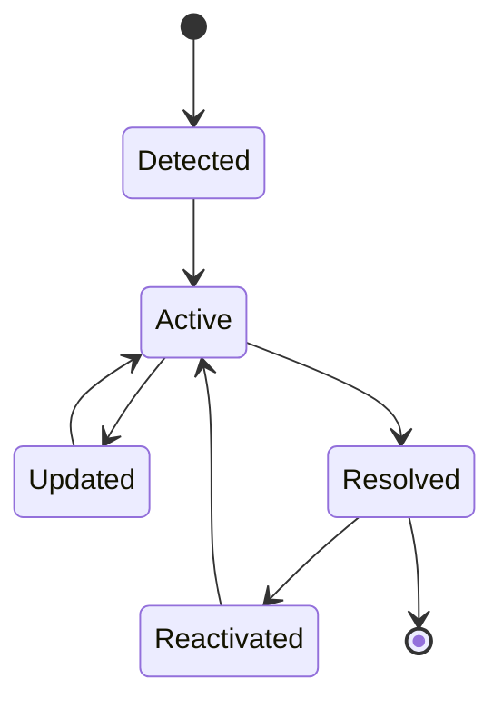
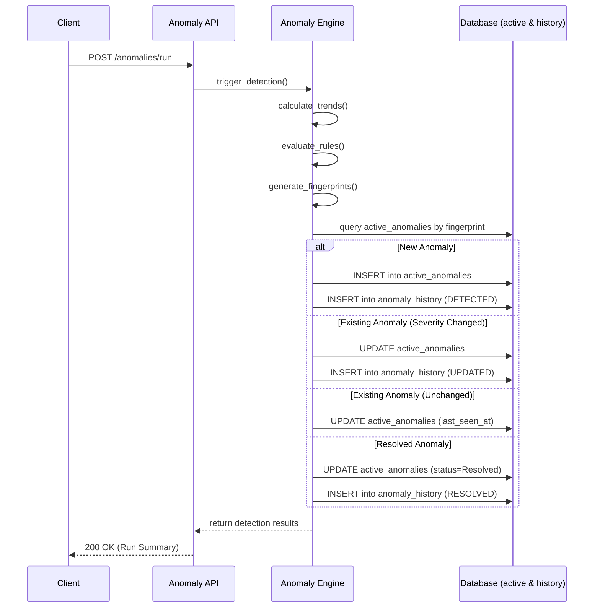

# Architecture Decision Records (ADR)

Project: Customer Experience Intelligence & Failure Detection Platform

## Purpose

This document records significant architectural and engineering decisions made during the development of the platform.

It captures **why** decisions were made, not implementation details. Routine bug fixes, refactoring, and feature additions should be tracked in the changelog instead.

---

## ARCH-001 — Modular Service-Based Architecture

**Status:** Accepted

**Date:** 2026-07-19

### Context

The platform consists of multiple intelligence capabilities including complaint ingestion, NLP enrichment, anomaly detection, root cause analysis, business impact estimation, recommendation generation, and an AI copilot.

### Decision

Adopt a modular service-based architecture within a shared monorepo. Each service owns a specific intelligence responsibility while sharing common infrastructure, utilities, and database patterns.

### Rationale

- Clear separation of concerns.
- Easier independent development and testing.
- Future migration to independently deployable services if required.
- Avoids premature distributed-system complexity.

### Consequences

**Pros**

- High maintainability.
- Clear ownership boundaries.
- Scalable project structure.

**Cons**

- Slight duplication between services.
- Additional coordination required between service interfaces.

---

## ARCH-002 — Shared PostgreSQL Database for MVP

**Status:** Accepted

**Date:** 2026-07-19

### Context

Early MVP development prioritizes engineering simplicity and rapid iteration over distributed persistence.

### Decision

Use a shared PostgreSQL database accessed through SQLAlchemy while maintaining logical service ownership of entities.

### Rationale

- Simplifies development.
- Reduces infrastructure complexity.
- Enables analytics across intelligence stages.
- Supports future migration if required.

### Consequences

**Pros**

- Faster development.
- Easier debugging.
- Simpler deployment.

**Cons**

- Services are logically isolated rather than physically isolated.

---

## ARCH-003 — Service Independence Between Ingestion and NLP

**Status:** Accepted

**Date:** 2026-07-19

### Context

The NLP service enriches complaint records created by the ingestion service.

### Decision

The `ComplaintEnrichment` entity stores only `complaint_id` and does not define an ORM relationship to the `Complaint` model.

### Rationale

- Maintains service independence.
- Prevents SQLAlchemy mapper coupling.
- Simplifies future service separation.

### Consequences

**Pros**

- Cleaner architecture.
- Easier testing.
- Stable mapper initialization.

**Cons**

- Complaint details must be explicitly queried when required.

---

## ARCH-004 — Deterministic NLP for MVP

**Status:** Accepted

**Date:** 2026-07-19

### Context

The roadmap targets explainable operational intelligence before introducing advanced AI models.

### Decision

Implement the initial NLP pipeline using deterministic rules and keyword-based classification instead of machine learning models.

### Rationale

- Fully explainable outputs.
- Faster implementation.
- Easier debugging.
- Stable and reproducible behavior.

### Consequences

**Pros**

- Transparent decision-making.
- No model training required.
- Predictable results.

**Cons**

- Lower linguistic flexibility.
- Less accurate than modern ML models on complex text.

---

## DATA-001 — Database-Level Referential Integrity Across Service Boundaries

**Status:** Accepted

**Date:** 2026-07-19

### Context

The platform adopts a modular architecture where the NLP service needs to enrich complaint records created by the Ingestion service, but without creating tightly coupled ORM models.

### Decision

The `ComplaintEnrichment` entity stores the `complaint_id` without an ORM `ForeignKey`. Referential integrity is enforced strictly by PostgreSQL database migrations, while each service owns only its own ORM models.

### Rationale

- Ensures data integrity without coupling Python model dependencies.
- Services do not have to share SQLAlchemy mappers.
- Facilitates future decoupling into separate databases if needed.

### Consequences

**Pros**

- Database-level safety.
- Decoupled ORM definitions.
- True service independence while maintaining data integrity.

**Cons**

- Requires careful management of raw database migrations.
- SQLAlchemy cannot automatically traverse relationships via `.complaint`.

---

## DATA-002 — Service-Local Read Models

**Status:** Accepted

**Date:** 2026-07-19

### Problem

Some services legitimately need to read data owned by another service — for example, the Anomaly Service's Trend Engine must read `complaints` and `complaint_enrichments`, owned by the Ingestion and NLP services respectively. Importing another service's SQLAlchemy ORM model class to do this reintroduces the same class of problem seen in Phase 4: SQLAlchemy mapper/metadata coupling, fragile startup behavior, and a hard Python-level dependency between services that are supposed to remain independently deployable.

### Decision

- Backend services must never import ORM models owned by another service.
- Each service defines its own minimal SQLAlchemy Core read models when direct database access to another service's tables is required.
- Read models exist only for querying already-persisted, shared data — they are not used for writes and carry no business logic.
- Business ownership of an entity (schema, migrations, write access) remains exclusively within the owning service, regardless of how many other services read from it.

### Rationale

- Prevents SQLAlchemy metadata coupling between services — the root cause of the Phase 4 mapper-initialization failure.
- Preserves service autonomy: any service can be developed, tested, and deployed without importing another service's Python package.
- Keeps read access explicit and minimal — a service declares exactly the columns it needs, nothing more.
- Generalizes the precedent set by ARCH-003 and DATA-001 (the NLP/Complaint relationship removal) into a platform-wide engineering standard rather than a one-off fix.

### Consequences

**Pros**

- No cross-service ORM class imports, ever.
- Each service's mapper configuration is fully self-contained and cannot be broken by another service's schema changes.
- Read models are cheap to write and easy to audit — a handful of `Column` declarations on a dedicated `MetaData` instance.

**Cons**

- Column definitions for a shared table may be duplicated, in reduced form, across every service that reads it.
- If the owning service changes a column's type or name, every dependent service's read model must be updated manually — there is no shared source of truth beyond the migration history.

---

## ANOMALY-001 — Hybrid Anomaly Lifecycle Management

**Status:** Accepted

**Date:** 2026-07-20

### Problem

The Anomaly Detection Engine needs a persistence strategy to store detected anomalies. Pure snapshot persistence (storing every anomaly on every run) leads to unbounded database growth and massive duplication, creating performance bottlenecks for simple dashboard queries. Conversely, latest-state-only persistence (overwriting existing anomalies) destroys the timeline, making future Root Cause Analysis (RCA) and Business Impact Analysis impossible.

### Alternatives Considered

1. **Pure Snapshot Persistence (Event Sourcing):** Create a new record for every detected anomaly during every run. (Rejected due to database bloat and slow querying for current state).
2. **Latest-State-Only Persistence (CRUD):** Update the anomaly in place, losing historical progression. (Rejected due to inability to support RCA and Explainability).
3. **Hybrid Approach:** Maintain an active state table for fast operational querying and an append-only timeline table for state changes. (Chosen).

### Decision

Implement a hybrid persistence architecture using two tables:
- `active_anomalies`: A mutable table representing the current state of ongoing issues (fast operational lookups).
- `anomaly_history`: An append-only ledger tracking lifecycle state changes (e.g., detection, severity updates, resolution) for historical RCA.

### Rationale

This approach provides O(1) operational dashboarding by querying only the active anomalies, while perfectly preserving the timeline context required by the future AI Copilot and Root Cause engines without storing redundant data. 

### Consequences

**Pros**
- Zero data bloat (snapshots are only created on state changes).
- Fast UI rendering (Dashboard only queries `active_anomalies`).
- Full auditability and perfect RCA integration (Timeline is preserved in `anomaly_history`).

**Cons**
- Requires more complex persistence logic to calculate state deltas during the detection run.

### Anomaly Lifecycle State Machine

The following diagram illustrates the anomaly lifecycle:

### Execution Flow

The sequence of the hybrid persistence model during a detection run:

---

## ANOMALY-002 — Fingerprint-Based Anomaly Identity

**Status:** Accepted

**Date:** 2026-07-20

### Purpose of Fingerprints

To reliably match a newly detected anomaly from the current run against an existing active anomaly in the database, the system requires a deterministic, stable identifier.

### Decision

Implement a stable anomaly identity using a deterministic SHA-256 hash (fingerprint) of the anomaly's core dimensions (e.g., `detector_type`, `dimension_value`). 

### Rationale

- **Stable Anomaly Identity:** An anomaly maintains the exact same ID across multiple engine executions as long as the underlying dimensional issue persists.
- **Duplicate Prevention:** The database enforces a unique constraint on the fingerprint for active anomalies, guaranteeing that the same issue is never double-counted.
- **Reactivation Behavior:** If a previously resolved anomaly resurfaces with the same fingerprint, it can be seamlessly reactivated and linked to its historical timeline.
- **Future Extensibility:** The fingerprinting logic is centralized. If new dimensions are added in the future, the hashing algorithm can be versioned to prevent breaking existing historical fingerprints.
