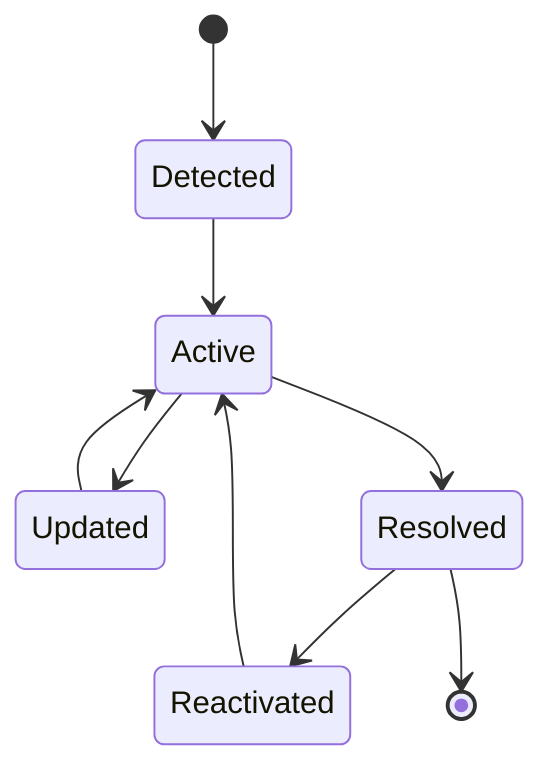
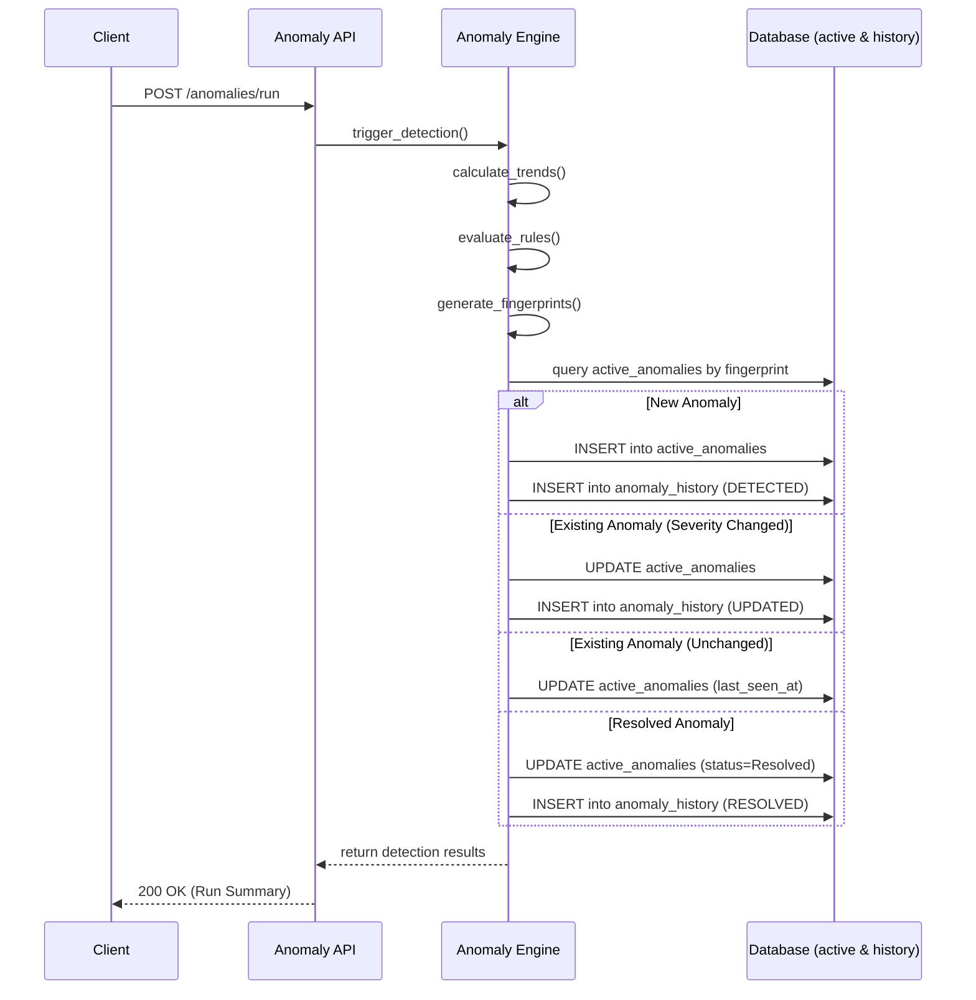

# Architecture Decision Records (ADR)

Project: Customer Experience Intelligence & Failure Detection Platform

## Purpose

This document records significant architectural and engineering decisions made during the development of the platform.

It captures **why** decisions were made, not implementation details. Routine bug fixes, refactoring, and feature additions should be tracked in the changelog instead.

---

## ARCH-001 — Modular Service-Based Architecture

**Status:** Accepted

**Date:** 2026-07-19

### Context

The platform consists of multiple intelligence capabilities including complaint ingestion, NLP enrichment, anomaly detection, root cause analysis, business impact estimation, recommendation generation, and an AI copilot.

### Decision

Adopt a modular service-based architecture within a shared monorepo. Each service owns a specific intelligence responsibility while sharing common infrastructure, utilities, and database patterns.

### Rationale

- Clear separation of concerns.
- Easier independent development and testing.
- Future migration to independently deployable services if required.
- Avoids premature distributed-system complexity.

### Consequences

**Pros**

- High maintainability.
- Clear ownership boundaries.
- Scalable project structure.

**Cons**

- Slight duplication between services.
- Additional coordination required between service interfaces.

---

## ARCH-002 — Shared PostgreSQL Database for MVP

**Status:** Accepted

**Date:** 2026-07-19

### Context

Early MVP development prioritizes engineering simplicity and rapid iteration over distributed persistence.

### Decision

Use a shared PostgreSQL database accessed through SQLAlchemy while maintaining logical service ownership of entities.

### Rationale

- Simplifies development.
- Reduces infrastructure complexity.
- Enables analytics across intelligence stages.
- Supports future migration if required.

### Consequences

**Pros**

- Faster development.
- Easier debugging.
- Simpler deployment.

**Cons**

- Services are logically isolated rather than physically isolated.

---

## ARCH-003 — Service Independence Between Ingestion and NLP

**Status:** Accepted

**Date:** 2026-07-19

### Context

The NLP service enriches complaint records created by the ingestion service.

### Decision

The `ComplaintEnrichment` entity stores only `complaint_id` and does not define an ORM relationship to the `Complaint` model.

### Rationale

- Maintains service independence.
- Prevents SQLAlchemy mapper coupling.
- Simplifies future service separation.

### Consequences

**Pros**

- Cleaner architecture.
- Easier testing.
- Stable mapper initialization.

**Cons**

- Complaint details must be explicitly queried when required.

---

## ARCH-004 — Deterministic NLP for MVP

**Status:** Accepted

**Date:** 2026-07-19

### Context

The roadmap targets explainable operational intelligence before introducing advanced AI models.

### Decision

Implement the initial NLP pipeline using deterministic rules and keyword-based classification instead of machine learning models.

### Rationale

- Fully explainable outputs.
- Faster implementation.
- Easier debugging.
- Stable and reproducible behavior.

### Consequences

**Pros**

- Transparent decision-making.
- No model training required.
- Predictable results.

**Cons**

- Lower linguistic flexibility.
- Less accurate than modern ML models on complex text.

---

## DATA-001 — Database-Level Referential Integrity Across Service Boundaries

**Status:** Accepted

**Date:** 2026-07-19

### Context

The platform adopts a modular architecture where the NLP service needs to enrich complaint records created by the Ingestion service, but without creating tightly coupled ORM models.

### Decision

The `ComplaintEnrichment` entity stores the `complaint_id` without an ORM `ForeignKey`. Referential integrity is enforced strictly by PostgreSQL database migrations, while each service owns only its own ORM models.

### Rationale

- Ensures data integrity without coupling Python model dependencies.
- Services do not have to share SQLAlchemy mappers.
- Facilitates future decoupling into separate databases if needed.

### Consequences

**Pros**

- Database-level safety.
- Decoupled ORM definitions.
- True service independence while maintaining data integrity.

**Cons**

- Requires careful management of raw database migrations.
- SQLAlchemy cannot automatically traverse relationships via `.complaint`.

---

## DATA-002 — Service-Local Read Models

**Status:** Accepted

**Date:** 2026-07-19

### Problem

Some services legitimately need to read data owned by another service — for example, the Anomaly Service's Trend Engine must read `complaints` and `complaint_enrichments`, owned by the Ingestion and NLP services respectively. Importing another service's SQLAlchemy ORM model class to do this reintroduces the same class of problem seen in Phase 4: SQLAlchemy mapper/metadata coupling, fragile startup behavior, and a hard Python-level dependency between services that are supposed to remain independently deployable.

### Decision

- Backend services must never import ORM models owned by another service.
- Each service defines its own minimal SQLAlchemy Core read models when direct database access to another service's tables is required.
- Read models exist only for querying already-persisted, shared data — they are not used for writes and carry no business logic.
- Business ownership of an entity (schema, migrations, write access) remains exclusively within the owning service, regardless of how many other services read from it.

### Rationale

- Prevents SQLAlchemy metadata coupling between services — the root cause of the Phase 4 mapper-initialization failure.
- Preserves service autonomy: any service can be developed, tested, and deployed without importing another service's Python package.
- Keeps read access explicit and minimal — a service declares exactly the columns it needs, nothing more.
- Generalizes the precedent set by ARCH-003 and DATA-001 (the NLP/Complaint relationship removal) into a platform-wide engineering standard rather than a one-off fix.

### Consequences

**Pros**

- No cross-service ORM class imports, ever.
- Each service's mapper configuration is fully self-contained and cannot be broken by another service's schema changes.
- Read models are cheap to write and easy to audit — a handful of `Column` declarations on a dedicated `MetaData` instance.

**Cons**

- Column definitions for a shared table may be duplicated, in reduced form, across every service that reads it.
- If the owning service changes a column's type or name, every dependent service's read model must be updated manually — there is no shared source of truth beyond the migration history.

---

## ANOMALY-001 — Hybrid Anomaly Lifecycle Management

**Status:** Accepted

**Date:** 2026-07-20

### Problem

The Anomaly Detection Engine needs a persistence strategy to store detected anomalies. Pure snapshot persistence (storing every anomaly on every run) leads to unbounded database growth and massive duplication, creating performance bottlenecks for simple dashboard queries. Conversely, latest-state-only persistence (overwriting existing anomalies) destroys the timeline, making future Root Cause Analysis (RCA) and Business Impact Analysis impossible.

### Alternatives Considered

1. **Pure Snapshot Persistence (Event Sourcing):** Create a new record for every detected anomaly during every run. (Rejected due to database bloat and slow querying for current state).
2. **Latest-State-Only Persistence (CRUD):** Update the anomaly in place, losing historical progression. (Rejected due to inability to support RCA and Explainability).
3. **Hybrid Approach:** Maintain an active state table for fast operational querying and an append-only timeline table for state changes. (Chosen).

### Decision

Implement a hybrid persistence architecture using two tables:
- `active_anomalies`: A mutable table representing the current state of ongoing issues (fast operational lookups).
- `anomaly_history`: An append-only ledger tracking lifecycle state changes (e.g., detection, severity updates, resolution) for historical RCA.

### Rationale

This approach provides O(1) operational dashboarding by querying only the active anomalies, while perfectly preserving the timeline context required by the future AI Copilot and Root Cause engines without storing redundant data. 

### Consequences

**Pros**
- Zero data bloat (snapshots are only created on state changes).
- Fast UI rendering (Dashboard only queries `active_anomalies`).
- Full auditability and perfect RCA integration (Timeline is preserved in `anomaly_history`).

**Cons**
- Requires more complex persistence logic to calculate state deltas during the detection run.

### Anomaly Lifecycle State Machine

The following diagram illustrates the anomaly lifecycle:


```mermaid
stateDiagram-v2
    [*] --> Detected
    Detected --> Active
    Active --> Updated
    Updated --> Active
    Active --> Resolved
    Resolved --> Reactivated
    Reactivated --> Active
    Resolved --> [*]
```

### Execution Flow

The sequence of the hybrid persistence model during a detection run:


```mermaid
sequenceDiagram
    participant Client
    participant API as Anomaly API
    participant Engine as Anomaly Engine
    participant DB as Database (active & history)
    
    Client->>API: POST /anomalies/run
    API->>Engine: trigger_detection()
    Engine->>Engine: calculate_trends()
    Engine->>Engine: evaluate_rules()
    Engine->>Engine: generate_fingerprints()
    Engine->>DB: query active_anomalies by fingerprint
    alt New Anomaly
        Engine->>DB: INSERT into active_anomalies
        Engine->>DB: INSERT into anomaly_history (DETECTED)
    else Existing Anomaly (Severity Changed)
        Engine->>DB: UPDATE active_anomalies
        Engine->>DB: INSERT into anomaly_history (UPDATED)
    else Existing Anomaly (Unchanged)
        Engine->>DB: UPDATE active_anomalies (last_seen_at)
    else Resolved Anomaly
        Engine->>DB: UPDATE active_anomalies (status=Resolved)
        Engine->>DB: INSERT into anomaly_history (RESOLVED)
    end
    Engine-->>API: return detection results
    API-->>Client: 200 OK (Run Summary)
```

---

## ANOMALY-002 — Fingerprint-Based Anomaly Identity

**Status:** Accepted

**Date:** 2026-07-20

### Purpose of Fingerprints

To reliably match a newly detected anomaly from the current run against an existing active anomaly in the database, the system requires a deterministic, stable identifier.

### Decision

Implement a stable anomaly identity using a deterministic SHA-256 hash (fingerprint) of the anomaly's core dimensions (e.g., `detector_type`, `dimension_value`). 

### Rationale

- **Stable Anomaly Identity:** An anomaly maintains the exact same ID across multiple engine executions as long as the underlying dimensional issue persists.
- **Duplicate Prevention:** The database enforces a unique constraint on the fingerprint for active anomalies, guaranteeing that the same issue is never double-counted.
- **Reactivation Behavior:** If a previously resolved anomaly resurfaces with the same fingerprint, it can be seamlessly reactivated and linked to its historical timeline.
- **Future Extensibility:** The fingerprinting logic is centralized. If new dimensions are added in the future, the hashing algorithm can be versioned to prevent breaking existing historical fingerprints.

---

## INCIDENT-001 — Incident-Centric Correlation Model

**Status:** Accepted

**Date:** 2026-07-20

### Problem

As the Anomaly Detection Engine scales, it will detect multiple related anomalies across different dimensions (e.g., a spike in "Login Failures" and a spike in "Authentication Errors" in the same region at the same time). If these individual anomalies are fed directly into the future Root Cause Analysis engine, it will create redundant RCA workflows and noise.

### Alternatives Considered

1. **Direct Anomaly RCA:** Send every anomaly independently to the Root Cause Engine. (Rejected due to noise and redundant causal evaluations).
2. **Incident-Centric Correlation (Chosen):** Introduce a logical grouping layer (Incident Correlation) at the end of Phase 5. This engine evaluates active anomalies and clusters related ones into unified "Incidents". 

### Decision

Implement an Incident Correlation Engine as the final step of Phase 5. This engine serves as the transition point between detection and causation. Anomalies are grouped into Incidents based on temporal, regional, and categorical proximity. The Root Cause Engine (Phase 6) will investigate *Incidents*, not individual anomalies.

### Rationale

- **Noise Reduction:** Operators and AI Copilots receive a unified incident report rather than dozens of redundant anomaly alerts.
- **Clearer Causation:** Investigating a cluster of related anomalies provides a stronger signal for the Root Cause Engine than investigating them in isolation.
- **Separation of Concerns:** Phase 5 is fully responsible for "What is happening?" (Trend -> Anomaly -> Incident), leaving Phase 6 entirely focused on "Why is it happening?" (Root Cause).

### Consequences

**Pros**
- Cleaner RCA architecture.
- Better operational dashboarding (focusing on Incidents rather than noisy anomalies).
- Highly structured data model preparing for Phase 6.

**Cons**
- Requires correlation logic and an additional schema entity (`Incident`) to track the groups.

---

## RCA-001 — Persistence-Independent Domain Input Model

**Status:** Accepted

**Date:** 2026-07-21

### Context

Root Cause Analysis (Phase 6) must consume `Incidents` generated by the Incident Correlation Engine (Phase 5). Importing Incident ORM models from the Anomaly Service into the Root Cause Service violates DATA-002 (Service-Local Read Models) and creates tight cross-service coupling.

### Decision

Introduce a persistence-independent `Incident` domain model (`domain/incident.py`) dedicated purely to Root Cause inference. This is a plain, immutable dataclass containing only the information required for rule evaluation.

### Rationale

- **Service Independence:** The Root Cause Engine does not depend on the internal database schema or ORM models of another service.
- **No ORM Coupling:** Avoids SQLAlchemy mapper initialization issues and dependency leakage.
- **Pure Domain Logic:** Keeps the Root Cause Engine purely functional, deterministic, and isolated.
- **Easier Testing:** The engine can be tested with plain dataclasses without requiring a database session.
- **Future Portability:** A completely isolated domain engine can be easily moved or scaled if needed.

### Consequences

**Pros**
- Fully isolated domain engine.
- Independent, fast, database-less unit testing.
- No SQLAlchemy dependencies inside the engine logic.
- Stable, predictable architecture.

**Cons**
- Requires mapping from persisted Incident entities in Step 2 before passing them into the engine.
- Small duplication of field definitions (Incident attributes exist in both the Phase 5 ORM and Phase 6 Domain).

---

## BI-001 — Business Impact Uses Deterministic Rules

**Status:** Accepted

**Date:** 2026-07-22

### Context

Phase 7 Step 1 must evaluate the business consequences of an Incident and its identified Root Cause. The platform's core principle is explainability-first: every output consumed by the AI Copilot must be fully auditable and reproducible without dependency on probabilistic models.

### Decision

The Business Impact Analysis Engine evaluates all five impact dimensions (Financial, Customer, Operational, SLA, Reputation) using deterministic, threshold-based rules. No machine learning, probabilistic scoring, or AI inference is used.

### Rationale

- **Explainability:** Every impact level can be traced to the exact rule condition and input value that triggered it.
- **Auditability:** Outputs are fully reproducible for any given set of inputs, enabling reliable regression testing.
- **Reliability:** Deterministic rules do not degrade over time or require retraining.
- **AI-Safe:** The AI Copilot downstream can safely consume the output knowing it was produced by auditable, transparent logic.

### Consequences

**Pros**
- Fully explainable and auditable impact assessments.
- Predictable, reproducible behavior across all environments.
- No model training, deployment, or versioning overhead.

**Cons**
- Rule thresholds require manual review and tuning as business conditions evolve.

---

## BI-002 — Independent ImpactRule Abstraction

**Status:** Accepted

**Date:** 2026-07-22

### Context

The Business Impact Engine must evaluate five distinct business dimensions. Each dimension has independent logic, thresholds, and escalation conditions. Coupling dimension logic within a single class or function would violate the Single Responsibility Principle and make isolated testing impossible.

### Decision

Define an `ImpactRule` abstract base class in the domain layer. Each of the five business dimensions is implemented as an independent, concrete rule class that implements this interface. No rule has knowledge of any other rule.

### Rationale

- **Single Responsibility:** Each rule class owns exactly one dimension's evaluation logic.
- **Isolated Testing:** Every rule can be unit-tested independently with no dependency on the engine or other rules.
- **Clarity:** The boundary between evaluation logic (rules) and orchestration logic (engine) is explicit.

### Consequences

**Pros**
- Independent development and testing of each dimension's rule.
- Adding a new rule requires no changes to existing rules.
- Rule logic is self-contained and easily reviewable.

**Cons**
- Requires a small number of parallel rule class definitions rather than a single conditional block.

---

## BI-003 — BusinessImpactEngine Orchestrates Injected ImpactRule Implementations

**Status:** Accepted

**Date:** 2026-07-22

### Context

The Business Impact Engine needs to coordinate the evaluation of all five business dimensions and assemble the final `BusinessImpactAssessment`. The engine must remain open for extension (new rules) without requiring modification, and must depend on the abstraction rather than concrete rule implementations.

### Decision

`BusinessImpactEngine` accepts a `Sequence[ImpactRule]` at construction time. It iterates over the injected rules, dispatches each evaluation, assembles the `BusinessImpactProfile`, and delegates to `scoring.py`, `weighting.py`, and `explanation.py` for the final assessment. A `default_rules()` factory in the same module provides the standard five-rule configuration.

### Rationale

- **Dependency Inversion:** The engine depends on the `ImpactRule` abstraction, never on concrete rule classes.
- **Open/Closed:** New rules can be injected without modifying the engine.
- **Testability:** The engine can be tested with any mock or stub implementation of `ImpactRule`.
- **Explicit Configuration:** The `default_rules()` factory makes the standard configuration discoverable without hiding it inside the engine constructor.

### Consequences

**Pros**
- Engine logic is completely decoupled from individual rule implementations.
- Rule composition is explicit and injectable.
- Future rule additions require zero engine changes.

**Cons**
- The caller is responsible for assembling the rule sequence (mitigated by the `default_rules()` factory).

---

## BI-004 — ImpactEvaluation Carries Deterministic Reasoning

**Status:** Accepted

**Date:** 2026-07-22

### Context

The explanation engine must generate deterministic, human-readable explanations for each dimension's impact level. If rules return only an `ImpactLevel` enum value, the explanation engine would need to duplicate rule logic to reconstruct why that level was reached — creating hidden coupling and violating the Single Responsibility Principle.

### Decision

Each `ImpactRule` returns an `ImpactEvaluation` value object containing the dimension, the level, and a pre-computed deterministic reason string. The explanation engine aggregates these reason strings without applying any additional business logic.

### Rationale

- **No Duplicated Logic:** The explanation engine never re-evaluates thresholds or conditions; it only aggregates pre-computed reasons.
- **Single Responsibility:** Each rule owns both the classification decision and its corresponding explanation.
- **Auditability:** Every reason string is deterministically generated at the point of rule evaluation, tied directly to the specific condition that fired.

### Consequences

**Pros**
- Explanation engine is a pure aggregator with no business logic.
- No hidden coupling between explanation generation and rule evaluation.
- Explanation output is fully traceable to the rule that produced it.

**Cons**
- Each rule must produce both a level and a reason string, slightly increasing rule complexity.

---

## BI-005 — BusinessImpactProfile Separates Evaluation from Final Assessment

**Status:** Accepted

**Date:** 2026-07-22

### Context

The Business Impact Engine produces five independent `ImpactEvaluation` results. These evaluations must be aggregated into a weighted business score, an overall severity classification, a priority level, a confidence score, and a final explanation before producing the output domain object. Combining all of this logic into a single step would produce an opaque, untestable transformation.

### Decision

Introduce `BusinessImpactProfile` as an intermediate value object that holds all five named `ImpactEvaluation` fields and provides an `all_evaluations()` helper. The engine passes the profile to `scoring.py`, `weighting.py`, and `explanation.py` independently before assembling the final `BusinessImpactAssessment`.

### Rationale

- **Separation of Responsibilities:** Profile assembly, score computation, and assessment construction are three distinct, independently testable steps.
- **Clarity:** The profile makes the intermediate state explicit rather than passing five separate arguments through multiple functions.
- **Testability:** Each transformation step (weighting, scoring, explanation) can be tested against a constructed `BusinessImpactProfile` without invoking the full engine pipeline.

### Consequences

**Pros**
- Clear intermediate representation of aggregated evaluation results.
- Independent testability of scoring, weighting, and explanation logic.
- Reduces argument count across internal engine functions.

**Cons**
- Introduces one additional domain object that does not appear in the final API output.

---

## BI-006 — Business Impact Service Owns Local Domain Input Models

**Status:** Accepted

**Date:** 2026-07-22

### Context

The Business Impact Engine requires structured input representing an Incident, a Root Cause Summary, Trend Metrics, and Anomaly Metrics. These domain concepts are owned by the Anomaly Service (Phase 5) and the Root Cause Service (Phase 6). Importing ORM models or domain classes from those services into the Business Impact Service would violate DATA-002 (Service-Local Read Models) and create tight cross-service coupling.

### Decision

Introduce four local, persistence-independent value objects within the Business Impact Service: `Incident`, `RootCauseSummary`, `TrendMetrics`, and `AnomalyMetrics`. These are plain, immutable dataclasses containing only the fields required for impact evaluation. They follow the same pattern established by RCA-001 (Persistence-Independent Domain Input Model) in Phase 6.

### Rationale

- **Service Independence:** The Business Impact Engine does not depend on ORM models or domain classes from Phase 5 or Phase 6 services.
- **No ORM Coupling:** The engine remains a pure, persistence-free domain component with no SQLAlchemy dependencies.
- **Consistency:** Follows the service-isolation convention already established and proven in Phase 6 (RCA-001).
- **Testability:** The engine can be fully tested using plain dataclass instances with no database or service dependencies.

### Consequences

**Pros**
- Fully isolated domain engine.
- No cross-service Python-level imports.
- Independent, database-less unit testing.
- Stable architecture regardless of upstream service schema changes.

**Cons**
- Requires a mapper in Phase 7 Step 2 to translate persisted ORM records into these plain input value objects before passing them to the engine.
- Small duplication of field definitions across service boundaries (mitigated by the minimal, purpose-scoped nature of each input model).

---

## ARB-001 — Platform Identity

**Status:** Accepted

**Date:** 2026-07-24

### Context

The platform's identity was described consistently in spirit across every document but had never been given a single, formal, citable name — leading to informal variation ("operational intelligence platform," "complaint analytics platform") in casual references.

### Decision

The platform is formally named the Customer Experience Intelligence & Operational Decision Support Platform. Its purpose is to transform customer complaints into explainable operational intelligence and evidence-based business decisions. The platform is NOT merely a complaint analytics dashboard.

### Rationale

- Gives a name to an identity that was already implicit in the product's non-goals and positioning.
- Prevents future documentation or onboarding material from drifting toward a "dashboard" framing the platform has always explicitly rejected.

### Consequences

**Pros**
- Consistent, citable identity across all documentation.

**Cons**
- None — purely a naming/documentation clarification.

---

## ARB-002 — Intelligence Lifecycle

**Status:** Accepted (long-term vision; not an MVP commitment)

**Date:** 2026-07-24

### Context

The documented intelligence pipeline (Complaint → NLP → Anomaly → Incident → Root Cause → Business Impact → Recommendation → Dashboard/Copilot) is a one-way flow. Nothing that happens after a recommendation is delivered ever flows back into the platform's intelligence.

### Decision

The platform's long-term architectural vision extends the pipeline into a complete lifecycle: Complaint → NLP → Anomaly → Incident → Root Cause → Business Impact → Recommendation → Human Action → Outcome → Organizational Knowledge → Continuous Improvement → AI Copilot. This is a long-term vision. It is explicitly NOT part of the MVP and does not change any current phase, deliverable, or roadmap commitment.

### Rationale

- Without capturing what happened after a recommendation, confidence scores and severity bands can never be validated against reality.
- Naming the destination now allows current phases to be built in a way that does not foreclose it later, without requiring any current work to change.

### Consequences

**Pros**
- Gives the roadmap an explicit long-term destination.
- Does not obligate any current phase to change.

**Cons**
- Introduces conceptual scope (Human Action, Outcome, Organizational Knowledge) that is not yet scheduled on the roadmap.

---

## ARB-003 — Business Impact Engine Remains Generic

**Status:** Accepted

**Date:** 2026-07-24

### Context

The platform is positioned for multiple industries (e-commerce, logistics, fintech, SaaS, telecom, marketplaces, subscription services) that define business impact differently, creating pressure for the Business Impact Engine to branch its scoring logic per organization.

### Decision

The Business Impact Engine remains deterministic, explainable, rule-based, and generic. It always evaluates every Business Impact dimension (Financial, Customer, Operational, SLA, Reputation). No dimensions are disabled. No organization-specific scoring logic is introduced. The engine produces one authoritative Business Impact Assessment. This reaffirms and reinforces BI-001 through BI-006 without altering their content.

### Rationale

- Preserves the engine's determinism, testability, and auditability established in BI-001 through BI-006.
- Organization-specific emphasis is handled at the Presentation Layer (ARB-004), not inside the engine, keeping the engine reusable and stable across every future industry vertical.

### Consequences

**Pros**
- The engine remains stable, generic, and reusable across organizations.
- Prevents scoring logic from fragmenting per customer.

**Cons**
- Organization-specific prioritization must be solved entirely at the presentation layer for now; a future, explicitly-designed configuration layer would be required if per-organization weighting is ever needed inside the engine itself. No such layer is introduced by this decision.

---

## ARB-004 — Presentation Layer Adapts Explanation, Not the Engine

**Status:** Accepted

**Date:** 2026-07-24

### Context

Different personas (Executive, Business Analyst, Reliability Engineer, Operations Manager) and different organizations legitimately care about different Business Impact dimensions for the same incident.

### Decision

Rather than changing Business Impact calculations, the Presentation Layer (Dashboard and AI Copilot) allows users to explore specific dimensions, compare dimensions, and request business-specific explanations. The Presentation Layer adapts the explanation, not the engine. Business reasoning remains consistent for every organization and every user.

### Rationale

- Keeps the engine (ARB-003) generic and universal while still letting different audiences focus on what matters to them.
- Ensures the same incident produces the same authoritative assessment regardless of who is viewing it — only the narration and framing differ.

### Consequences

**Pros**
- Full flexibility of exploration and explanation without compromising engine determinism.

**Cons**
- Presentation Layer must be designed to filter/compare/re-narrate an already-computed assessment rather than requesting a recomputation — a constraint future dashboard/copilot design must respect.

---

## ARB-005 — Organizational Knowledge

**Status:** Accepted (long-term vision; not an MVP commitment)

**Date:** 2026-07-24

### Context

Every anomaly, root cause, and impact assessment is currently evaluated as if it were the first of its kind; the platform has no memory of recurring patterns or prior responses.

### Decision

The platform should preserve organizational knowledge. Future phases should support learning from Human Actions, Outcomes, Historical Incidents, and Previous Recommendations, enabling continuous organizational learning. This is long-term vision only; no current phase, entity, or persisted schema is affected.

### Rationale

- Provides the substantive content behind the "Organizational Knowledge" and "Continuous Improvement" stages of ARB-002's lifecycle.
- Names a destination without prescribing implementation, preserving full design freedom for whichever future phase takes this on.

### Consequences

**Pros**
- Establishes long-term direction for future roadmap planning.

**Cons**
- No mechanism, schema, or phase is defined yet — intentionally deferred.

---

## ARB-006 — Evidence Chain (Conceptual)

**Status:** Accepted

**Date:** 2026-07-24

### Context

Each intelligence stage already produces its own explainable output (NLP enrichment fields, anomaly explanations, Root Cause `Evidence` objects, Business Impact `ImpactEvaluation` reasons) independently, with no document naming these as segments of one continuous story.

### Decision

Every intelligence stage contributes evidence. The platform should conceptually maintain a connected evidence chain across Complaint → NLP → Anomaly → Incident → Root Cause → Business Impact → Recommendation. This is a conceptual architecture decision, not an implementation requirement.

### Rationale

- Names a principle that already exists in practice, guiding future explainability and AI-copilot work toward treating the chain as one evidentiary narrative.
- Explicitly does not require a shared schema or new service, preserving every service's autonomy over its own explanation format (consistent with DATA-002).

### Consequences

**Pros**
- Gives future explainability/RAG work a documented principle to build toward.

**Cons**
- None — no implementation change is required or introduced.

---

## ARB-007 — Incident as the Central Lifecycle Object

**Status:** Accepted

**Date:** 2026-07-24

### Context

Some documentation (e.g. SERVICE_RESPONSIBILITY_AND_PERSISTENCE_ARCHITECTURE.md, prior to this session) described Root Cause correlation in terms of a generic complaint-event link, distinct from the Incident entity already established by INCIDENT-001 and consumed by Root Cause Analysis per RCA-001. This created a risk of introducing a duplicate "Case"-like concept.

### Decision

A separate "Case" entity will NOT be introduced. Instead, Incident naturally evolves into the central lifecycle object connecting Anomalies → Root Cause → Business Impact → Recommendation → Human Action → Outcome → Organizational Knowledge.

### Rationale

- Incident already plays this role in practice (INCIDENT-001, RCA-001); introducing a parallel "Case" concept would duplicate an existing entity.
- Gives every future stage (Recommendation, Human Action, Outcome, Organizational Knowledge) a single, existing anchor object to attach to.

### Consequences

**Pros**
- No duplicate entity; Incident's existing central role is simply made explicit.
- Every future lifecycle extension has a clear, already-implemented attachment point.

**Cons**
- Documentation describing Root Cause correlation in terms other than "consumes Incidents" (see this session's documentation alignment) required correction to remove the contradiction.

---

## ARB-008 — Confidence Remains Stage-Specific

**Status:** Accepted

**Date:** 2026-07-24

### Context

"Confidence" is produced by multiple stages (NLP classification, anomaly severity, Root Cause `confidence_score`/`confidence_level`, Business Impact `confidence`) with materially different meanings, previously undocumented as intentional.

### Decision

Confidence remains stage-specific. Each service owns its own confidence definition. The architecture clarifies this explicitly. It does NOT force one universal confidence score.

### Rationale

- Root Cause's confidence measures certainty that the correct deterministic rule fired; Business Impact's confidence measures completeness of available input data. These are not interchangeable and should not be forced onto one scale.
- Documenting this as intentional prevents a future, well-intentioned "unification" effort from destroying meaningful, stage-specific signal.

### Consequences

**Pros**
- Prevents loss of meaning from forcing dissimilar concepts onto one scale.
- Gives future engineers a clear, documented reason not to "fix" this into a single universal score.

**Cons**
- A future Copilot or dashboard summarizing "confidence" across stages must present it per-stage rather than as one number — an explicit design constraint, not a defect.

---

## EVAL-001 — In-Process Event Consumer/Publisher Pending a Real Message Broker

**Status:** Accepted

**Date:** 2026-07-28

### Context

Phase 8 Step 3's frozen architecture requires an Infrastructure Event Consumer receiving `BusinessImpactCompleted` events and an Infrastructure Event Publisher emitting `EvaluationCompleted` events. Before implementation began, the platform was inspected for existing messaging infrastructure: no message broker (RabbitMQ, Kafka, Redis, or otherwise) exists anywhere in this repository — not in `docker-compose.yml`, not in any service's `requirements.txt`, not in `backend/shared/`. No service publishes any event today; `business_impact_service`'s own `create_assessment()` flow ends at its repository's `save()` with no event emission. The frozen architecture specifies consumer/publisher *responsibilities* but never mandates a specific transport technology, and introducing one (a broker, new `docker-compose` service, cross-service wiring into `business_impact_service`) would be a scope decision beyond implementing the frozen design, and would require modifying an already-completed, out-of-scope service.

### Decision

Implement the Event Consumer (`BusinessImpactCompletedConsumer`) and Event Publisher (`InProcessEventPublisher`) as Infrastructure adapters behind Application-owned ports (`EventPublisher`), backed by an in-process implementation: the Consumer is exposed via a thin internal HTTP route (`POST /internal/events/business-impact-completed`) rather than a real broker subscription, and the Publisher records outbound events via the standard logger rather than a real broker client. `EvaluationLifecycleService` and everything above it depends only on the abstract `EventPublisher` port and never on a concrete transport.

### Rationale

- The frozen architecture's own Publisher Behaviour section already treats this platform as prototype-stage (explicitly rejecting the Outbox Pattern for the same reason), making an in-process stand-in a consistent, not exceptional, choice.
- Keeping the Consumer/Publisher behind Application-owned ports (the same Dependency Inversion pattern already established for `EvaluationRepository`) means introducing a real broker later is a pure Infrastructure-layer change — a new adapter implementing the same `EventPublisher` port, wired in at the same composition root (`presentation/dependencies.py`) — with zero impact on `EvaluationLifecycleService`, `EvaluationOrchestrator`, or the Domain.
- Avoids silently introducing new platform-wide infrastructure (a broker choice, new deployment dependency, new service-to-service wiring) as a side effect of implementing one service's execution lifecycle.

### Consequences

**Pros**
- Phase 8 Step 3 is fully implementable and independently verifiable today, with no dependency on infrastructure that doesn't yet exist.
- The eventual real-broker migration is isolated to Infrastructure: no Application/Domain code changes required.

**Cons**
- `business_impact_service` does not yet actually emit a `BusinessImpactCompleted` event — nothing in the platform will invoke this pipeline in production until a real event source and transport exist. The internal HTTP route is a deliberate, documented stand-in, not a production trigger.
- Whichever broker technology is eventually chosen (and the accompanying `business_impact_service` change to actually publish) remains an open decision for a future phase.

---

## REC-001 — Recommendation Rules Are Organized One Rule Per Recommendation Category

**Status:** Accepted

**Date:** 2026-08-01

### Context

During Phase 9 Step 1's final engineering review, an alternative rule-organization scheme was raised: instead of one `RecommendationRule` per `RecommendationCategory` (e.g. `EscalationRule` producing only `ESCALATE`), organize rules around business policies (e.g. a single `SLAProtectionRule` internally deciding to emit `ESCALATE`, `CUSTOMER_COMMUNICATION`, and increased monitoring together, whenever SLA risk is detected). The question was whether this Business-Policy shape would better reflect how a stakeholder actually describes the domain ("our SLA policy is to escalate, notify the customer, and monitor more closely").

### Decision

Keep the current one-rule-per-category design. Each `RecommendationRule` owns exactly one `RecommendationCategory` and never emits any other. When one underlying business signal genuinely warrants multiple categories of response, that emerges from multiple independent rules each firing on their own criteria against the same shared `IntelligenceContext` — not from one rule internally bundling several categories together.

### Rationale

- **The "one signal, multiple actions" need is already met** by the existing pipeline (`IntelligenceContext -> independent rules -> raw Recommendations -> Consolidator`), without a Business-Policy rule shape: if SLA risk is severe enough, `SLAProtectionRule` fires for `SLA_PROTECTION`, and if the same underlying severity also crosses `EscalationRule`'s and `CustomerCommunicationRule`'s own independent thresholds, they fire too — the "cascade" a Business Policy would hand-code is instead an emergent property of several small, focused rules sharing one input. The question's own example is achievable today without any code change.
- **Open/Closed Principle**: category-per-rule is strictly more open/closed. Adding a brand-new, independent category is a pure addition (one new file, one new enum value, one new line in `default_rules()`) with zero modification to any existing rule. Under a Business-Policy scheme, making an existing policy also cover a new category requires modifying that policy's internal branching — a direct OCP violation the current design avoids by construction.
- **Clean separation of pipeline stages**: the frozen architecture deliberately splits "detection" (Rules) from "cross-cutting resolution" (`RecommendationConsolidator` — dedup, merge, conflict resolution, ordering). A policy rule that internally decides "these categories belong together" would be making a consolidation-level decision inside a rule, blurring a boundary the architecture drew on purpose.
- **DDD consistency across the platform**: this repeats the exact decomposition principle already used by `root_cause_service` (one `Rule` per `RootCause`) and `business_impact_service` (one `ImpactRule` per `ImpactDimension`) — the service's primary Domain classification enum is always the unit of rule decomposition. `RecommendationCategory` is explicitly a Domain Enum in the frozen architecture; treating it with the same seriousness maintains a platform-wide convention, not just local consistency.
- **Human Action phase compatibility** (ADR-002's long-term `Recommendation -> Human Action -> Outcome` lifecycle): each `Recommendation` already carries exactly one category and is independently addressable. A future Human Action tracker will want to record disposition (actioned / dismissed / pending) per Recommendation. Category-per-rule naturally produces independently-actionable records; a policy rule bundling several categories into "one response" would still need to emit them as separate `Recommendation` objects to support this — at which point it is functionally identical to several independent category-rules, just relocated into fewer, larger files.
- **Maintainability**: eight small (~60-90 line), independently testable rule files versus fewer, larger policy files with more internal branching and more test-case combinations per file — directly serving the frozen architecture's own instruction to "prefer small composable classes over monolithic implementations."

### Consequences

**Pros**
- Every category is independently addable, testable, and (later) actionable without touching existing rules.
- Matches the platform-wide precedent (Root Cause, Business Impact) of decomposing rules by the service's primary Domain enum.
- Keeps rule-level detection and Consolidator-level resolution as two genuinely distinct responsibilities.

**Cons**
- Minor duplication of threshold tuples (e.g. `("high", "critical")`) across a handful of rule files that each independently check a different `BusinessImpactSummary` dimension — flagged as a non-blocking, low-value "Can Improve Later" item in the Phase 9 Step 1 final review, not a consequence of this decision specifically.
- If a future category genuinely requires reasoning that cannot be decomposed per-category without real logic duplication (not just a repeated constant), this decision should be revisited then — not preemptively redesigned now against a hypothetical.

---

## REC-002 — Persistence of Recommendation Action Field

**Status:** Accepted

**Date:** 2026-08-01

### Context

During Phase 9 Step 2 implementation, an omission in the frozen architecture was discovered. The frozen persistence specification omitted the `action` field from both relational and JSONB column definitions. However, `action` is a mandatory domain field enforced by the `Recommendation` aggregate's `__post_init__` method.

### Decision

Introduce `action` as a relational column in the `RecommendationEntity` ORM model.

### Rationale

- **Aggregate Integrity:** To satisfy the repository pattern's contract, whatever goes into `save_many()` must be perfectly restorable by `list_by_incident()`. Dropping `action` violates this contract, as the aggregate cannot be reconstructed without it.
- **Clean Architecture:** Adding the column to the ORM model aligns the Infrastructure layer with the Domain layer's reality. It does not leak persistence into the domain; rather, it ensures persistence faithfully serves the domain.
- **Relational vs JSONB:** Adding it as a relational column (rather than burying it in the `supporting_evidence` JSONB) is the correct implementation choice because `action` is a core operational routing field (e.g., "Restart Service") that consumers will likely want to filter or group by in future dashboard queries, much like `category`.

### Consequences

**Pros**
- Fully preserves `Recommendation` aggregate integrity.
- Resolves a documentation omission without breaking any tests or frozen domain engines.
- Facilitates future dashboarding capabilities.

**Cons**
- None. This corrects an incomplete wording in the original specification.

---

## FE-001 — Action Center Retired; Recommendations Owns the Decision & Action Lifecycle

**Status:** Accepted

**Date:** 2026-08-05

### Context

Phase 10 Step 1 froze a six-workspace frontend architecture: Dashboard, Action Center, Investigations, Recommendations, Analytics, Administration. Action Center was scoped as "an operational work queue" surfacing active incidents, complaint spikes, SLA risks, and active investigations — everything "currently requiring operational attention."

A Product Architecture Review conducted before Phase 10 Step 3 scoping began found that Action Center's responsibility did not hold up as an independent workspace once examined against what it actually contained. Every item on its queue was, in substance, either: (a) something Investigations already owns the narrative for (active incidents, complaint spikes — both are Operational Story material), or (b) something Recommendations already owns the lifecycle for once a response exists (SLA risk mitigation, active-investigation follow-through). Action Center was not adding a distinct responsibility; it was re-surfacing other workspaces' content under a different label, which is exactly the "unrelated widgets on one page" pattern both the Dashboard architecture and the Product Experience Guide's workspace philosophy explicitly warn against (Section 2.2 — a workspace should be "a complete operational context," not a duplicate view).

The review also found that Action Center left a real gap unaddressed: nothing in the frozen six-workspace architecture explicitly owned what happens *after* a recommendation exists — approval, rejection, implementation tracking, and completed-action history. That gap was implicitly assumed to belong somewhere, but no workspace claimed it.

### Decision

Retire Action Center as a standalone workspace. Its route, navigation entry, workspace component, and dedicated icon are removed. Its "requires operational attention" framing is replaced by giving Recommendations explicit, complete ownership of the operational decision-and-action lifecycle: recommendation review, approval, rejection, implementation status, monitoring, and completed actions — the gap Action Center never actually closed.

Refined workspace architecture: **Dashboard → Investigations → Recommendations → Analytics → Administration.**

This is a navigation and ownership refinement, not a redesign. Dashboard, Investigations, Analytics, and Administration are unchanged. Recommendations' existing structure (queue, history, status) is extended, not rebuilt. No business functionality (real approval/rejection workflows, real monitoring data) was implemented as part of this refinement — only the architectural placeholder structure was updated to reflect the new ownership, per the same "structure only" discipline every prior Phase 10 step has followed.

### Rationale

- **Why Action Center was removed**: it duplicated content rather than owning a distinct responsibility — a direct violation of the frozen architecture's own rule that "responsibilities must never overlap" between workspaces (Phase 10 Dashboard architecture) and the Product Experience Guide's insistence that a workspace represent "a complete operational context rather than an isolated software module" (Section 2.2).
- **Why Recommendations became the Decision & Action workspace**: it already owned "lifecycle management, history, and status" for recommendations — the natural, and only unclaimed, owner of what happens after a recommendation is made. Extending an existing owner's responsibility is lower-risk and more coherent than inventing a new home for orphaned functionality.
- **Why this better aligns with the product mission**: the Product Experience Guide's Principle 1 is that the platform exists to help users make and act on operational decisions, and "reduce cognitive effort" (Principle 4) by avoiding duplicate information across screens. A single workspace that carries a recommendation from discovery through to a completed action is a shorter, more coherent path than routing a user through a separate Action Center queue that re-lists the same items.
- **Why the refinement occurred before additional workspace implementation**: Phase 10 Step 3 is about to implement real, business-facing dashboard functionality. Correcting a structural overlap now costs one workspace removal and a handful of reference updates; correcting it after Step 3 builds real data-fetching, filtering, and interaction logic against Action Center would multiply the cost and risk regressions in shipped functionality. This is the same "smallest-impact solution preserving architectural correctness" principle every prior phase in this project has applied to genuine architecture conflicts.

### Migration Impact

- **Low risk.** Action Center held no real business logic or data-fetching (Phase 10 Step 1/Step 2 explicitly forbade implementing it) — every reference removed was structural (a route, a nav entry, a lazy import, an icon, a handful of doc-comment examples), not behavioral.
- Verified by direct repository search: every file referencing Action Center (13 files, all frontend) was located and either removed (the workspace itself) or updated (route table, navigation config, workspace type union, icon registry, and five doc-comment cross-references in shared components).
- Full verification suite (typecheck, lint, build, complete automated test suite) passes with no regressions. No test hardcoded a reference to Action Center or a fixed workspace count, so no test required updating for the removal itself.
- No backend service, API contract, or persisted data was affected — this is a frontend-only, presentation-layer refinement.

### Consequences

**Pros**
- Removes a workspace that duplicated content instead of owning a distinct responsibility, restoring "responsibilities must never overlap" as an actually-true property of the architecture, not just a stated intent.
- Closes the previously-unclaimed decision-and-action ownership gap explicitly, before Step 3 has to work around its absence.
- Fewer workspaces to keep in sync as Phase 10 Step 3 and beyond add real functionality — one fewer navigation entry, route, and workspace shell to maintain.
- Sets a precedent: workspace responsibilities are revisited and corrected when a genuine overlap is found, rather than carried forward indefinitely once frozen.

**Cons**
- None identified. Action Center had zero implemented business functionality to migrate, and no other phase or document depended on its existence (verified: it was never named in PRD.md, ARCHITECTURE.md, ROADMAP.md, or PRODUCT_EXPERIENCE_GUIDE.md).

---

## REC-003 — Minimal Recommendation Decision Persistence Without Attribution

**Status:** Accepted

**Date:** 2026-08-12

### Context

Step 7.X's capability audit found that Recommendation Decision/Lifecycle (Phase 10 Step 4/A-07) rendered an honest placeholder rather than fabricated data, but no domain concept of a "decision" existed anywhere in `recommendation_service` — not a wiring gap, but a missing domain concept requiring an explicit decision before any implementation could begin (see `docs/architecture/phase-10/STEP_7X_SCOPE_FREEZE.md`, G-01).

The natural, complete version of "record a decision" would include who made it and what authority they had to make it. Neither exists in this platform: there is no authentication, no user model, and no RBAC (Phase 13, per `ROADMAP.md`). Building attribution now would mean inventing a throwaway identity concept purely to satisfy this one feature, one that would almost certainly conflict with or be discarded by the real Phase 13 authentication design.

### Decision

`RecommendationEntity` gains three new, nullable, additive columns: `decision` (enum: `pending`/`approved`/`rejected`/`deferred`), `decision_note` (free text), and `decided_at` (server-set timestamp). A single `PATCH /recommendations/{recommendation_id}/decision` endpoint records or overwrites these three fields. No decision-owner, actor, approval-authority, or audit-trail field is introduced anywhere in this design. Repeated PATCH calls unconditionally overwrite the prior decision — there is no conflict detection, since conflict detection would itself require knowing who is in conflict with whom.

### Rationale

- **Minimal-viable over speculative-complete:** a decision record answering only "what is the current state and optional note" is a real, usable capability today. A decision record answering "who decided, and were they allowed to" is not achievable honestly without authentication, so attempting it now would mean either fabricating an identity or blocking the whole feature on Phase 13.
- **No throwaway modeling:** inventing a placeholder "decision owner" field now (e.g., a free-text name) would create a fake-looking real field — exactly the kind of "looks real but isn't" presentation Step 7.X exists to eliminate elsewhere (see A-07's own motivation). Omitting the field entirely is the honest choice, not a shortcut.
- **Forward-compatible:** adding an actor/owner column later, once Phase 13 authentication exists, is a pure additive migration — nothing about this design needs to be reworked or reversed to support it.
- **Consistent with existing persistence conventions:** the nullable-column, additive-migration approach mirrors REC-002's own precedent (adding `action` to `RecommendationEntity` without disturbing the frozen aggregate), and the overwrite-on-repeated-PATCH semantics are the simplest behavior consistent with having no attribution to arbitrate a conflict.

### Consequences

**Pros**
- Recommendation Decision becomes a real, persisted capability instead of an honest placeholder, closing the last major Recommendation Workspace gap from Phase 10 Step 4.
- `recommendation_id` and `incident_id` remain untouched and undisturbed — no new identifier concept was introduced.
- The design imposes no migration cost or rework risk on the eventual Phase 13 authentication work.

**Cons**
- A decision cannot currently answer "who approved this" or "was this an authorized approval" — genuinely absent until Phase 13. Any consumer of this data must not assume attribution exists.
- Because there is no conflict detection, two people editing the same recommendation's decision in quick succession will silently overwrite one another. This is an accepted, documented limitation of the prototype stage, not an oversight.

---

## COPILOT-001 — Copilot Tool Boundary, Read-Only Authority, and Investigation/Analytics Composition

**Status:** Accepted

**Date:** 2026-08-13

### Context

An external architecture review of the initial Phase 12 draft (`docs/architecture/phase-12/PHASE_12_ARCHITECTURE.md`) found two P0 contradictions against the actual repository. First, the draft's topology diagram depicted "Analytics Service" and "Investigation Service" as real backend services peer to Root Cause/Business Impact Service; neither exists — `backend/services/` contains 9 services total, and "Investigation"/"Analytics" are Gateway-only aggregation code (`gateway_service/app/services/investigation_aggregator.py`, `analytics_aggregator.py`) composing calls to `anomaly_service`, `root_cause_service`, `business_impact_service`, `recommendation_service`, and `nlp_service`. Second, the draft's tool list named a "Recommendation Decision Tool" while the same document's own tool-security section forbade all decision mutations in Phase 12 — a direct self-contradiction, since the only decision-related endpoint that exists (`PATCH /recommendations/{id}/decision`) is a real mutation.

### Decision

1. **No `investigation_service` or `analytics_service` is introduced.** The Investigation Tool and Analytics/Trend Tool are Copilot-owned, read-only composition adapters that call the real downstream services directly (§8/§9 of the Phase 12 architecture), never the public Gateway. Gateway's existing aggregators remain the sole implementation backing the public API and are unmodified.
2. **No extraction of Gateway's aggregation logic into `backend/shared/` is performed for Phase 12.** The resulting duplication between Gateway's aggregators and Copilot's tool adapters (both compose the same underlying service calls) is an accepted, conscious tradeoff, not an oversight — revisit only if the two implementations are found to drift in substance, not presentation.
3. **"Recommendation Decision Tool" is renamed to "Recommendation Decision Status Tool"** and is strictly read-only: it may read `decision`/`decision_note`/`decided_at` from the existing `GET /recommendations/{id}` response; it must never call `PATCH /recommendations/{id}/decision`.
4. **Every Phase 12 Copilot tool is read-only, as an absolute, cross-batch invariant.** No generic HTTP tool, no arbitrary-URL tool, no direct-database tool, no service-internal execution tool. Every known mutation endpoint on every domain service (`PATCH /recommendations/{id}/decision`, `PATCH /root-causes/{id}/confirm`, `PATCH /root-causes/{id}/reject`, `POST /root-causes/{id}/refresh`) is explicitly, individually excluded from the tool registry.

### Rationale

- **Honesty over convenience:** naming a nonexistent service in the architecture would have propagated a false assumption into every subsequent implementation batch's tool-adapter design.
- **Read-only is the single load-bearing security property of Phase 12** (no authentication exists yet — Phase 13). An ambiguously-named tool is the most likely way a read-only boundary silently becomes a write boundary during implementation; resolving the name now removes that risk before any code exists.
- **No premature refactoring:** extracting a shared composition primitive now, before a second real consumer's needs are known in detail, risks building the wrong abstraction — the existing precedent throughout this platform (DATA-002, RCA-001, BI-006) is to accept bounded, service-local duplication over premature cross-service coupling.

### Consequences

**Pros**
- Every Phase 12 batch can be implemented against a topology and tool registry that actually matches the repository.
- The read-only boundary is unambiguous and individually verifiable per tool, per endpoint.

**Cons**
- Gateway's investigation/analytics composition and Copilot's tool adapters are two independent implementations of similar logic; they are not guaranteed to stay in sync automatically and must be kept consistent by convention and test coverage, not shared code.

---

## COPILOT-002 — Copilot Conversation Ownership and Retention

**Status:** Accepted

**Date:** 2026-08-13

### Context

Phase 12's architecture requires short-term conversation persistence for follow-up-question continuity (e.g., a user asking "Why?" after a prior answer). The initial draft required this capability without stating which service owns the resulting data, where it is stored, or how long it is retained — a gap inconsistent with this project's established documentation discipline for every other persisted entity (ARCH-002, DATA-002, RCA-001, BI-006, REC-003 all state persistence ownership explicitly).

### Decision

`copilot_service` owns conversation persistence in the platform's existing shared PostgreSQL instance (ARCH-002), via two service-owned tables (conceptual, not yet implemented): `copilot_conversations` and `copilot_messages`. No other service ever reads or writes these tables. Retention for the prototype is **no automatic expiry** — the same posture every other entity in this platform already has (no service anywhere implements TTL/archival today). Production retention/privacy policy (encryption posture, user-initiated deletion, automatic expiry) is explicitly identified as future production hardening, not a Phase 12 deliverable. Conversation history is explicitly distinct from, and is not a step toward, the long-term "Organizational Knowledge" vision (ARB-002/ARB-005) — it is never aggregated across users or referenced by any domain service.

### Rationale

- **Consistency with ARCH-002:** every service already persists its own entities in the shared database; conversation data is not a special case requiring new infrastructure.
- **Avoiding speculative design:** inventing a retention/archival subsystem now, before any real usage pattern exists, would be exactly the kind of premature complexity this platform's engineering discipline (see BI-003, ARB-003) consistently avoids elsewhere.
- **Explicit is better than implicit:** stating "no automatic expiry, revisit under Phase 13" is a real, documented decision a future engineer can find and challenge — silence would have looked like an oversight instead.

### Consequences

**Pros**
- Conversation persistence has a clear, unambiguous owner and storage location before any table is created.
- The prototype-vs-production retention distinction is explicit, preventing a future audit from mistaking "no TTL" for a missed requirement.

**Cons**
- Conversation content persists indefinitely in the prototype with no built-in purge mechanism — acceptable for this stage, but a real gap a production deployment must close (tracked here as future hardening, not deferred silently).

---

## OBS-002 — Intelligence Pipeline Dashboard Deferred Pending Real Domain Metrics

**Status:** Accepted

**Date:** 2026-08-13

### Context

The frozen Phase 11 architecture (`docs/architecture/phase-11/PHASE_11_ARCHITECTURE.md` §3.9) specified a third Grafana dashboard, "Intelligence Pipeline," backed by "service-owned domain metrics... anomalies detected, incidents correlated, recommendations generated, business impact assessments by severity, etc." At Batch 4 closure, a repository-wide check confirmed zero `Counter`/`Histogram`/`Gauge` domain metrics exist anywhere in any service — only the shared HTTP metrics (Batch 1) exist. No Phase 11 batch's backend scope (Batch 1: logging/correlation/metrics-foundation/health; Batch 2: tracing; Batch 3: reliability/error-visibility; Batch 4: "Backend: None — consumes Batches 1–3's output only") ever committed to implementing these metrics. The top-level `ARCHITECTURE.md` §10 that originally named them uses only aspirational language ("may include," "should support") without specifying exact semantics, ownership, or instrumentation points.

### Decision

Dashboard 3 ("Intelligence Pipeline") is deferred out of Phase 11. Phase 11 closes with two Grafana dashboards — Platform Health and API & Service Performance — both backed entirely by real, already-implemented telemetry. Building Intelligence Pipeline is deferred to a future initiative that first adds real domain-metric instrumentation to the owning services (anomaly_service, root_cause_service/anomaly correlation, recommendation_service, business_impact_service), each service defining and incrementing its own metric via the existing shared `Counter`/`Histogram`/`Gauge` factory (`backend/shared/observability/metrics.py`), exactly as §3.5 already describes. The Phase 11 Definition of Done (§7, item 7 of the frozen architecture) is amended: "Grafana ships exactly three dashboards" becomes "Grafana ships the two dashboards backed by telemetry that exists as of Phase 11 (Platform Health, API & Service Performance); Intelligence Pipeline is explicitly deferred pending domain-metric instrumentation."

### Rationale

- **No-fabrication principle:** instrumenting these metrics now, without any batch ever having specified their exact semantics (what precisely counts as "an anomaly detected," at which pipeline stage), would mean inventing business semantics to satisfy a dashboard — exactly what Phase 11's own dashboard-honesty rules (§3.9, "no dashboard renders a static or seeded number as if it were live telemetry") exist to prevent, generalized to metric *definition*, not just display.
- **Scope discipline:** Batch 4 was explicitly scoped as "Backend: None (consumes Batches 1–3's output only)" — a Grafana/visualization-only batch. Adding new domain instrumentation to four business services is backend/business-service work that was never part of any Phase 11 batch's committed scope.
- **This is the frozen architecture's own unsupported assumption**, not a missing implementation task: §3.9 assumed these metrics would exist by Batch 4 close, but no batch's plan ever built them.

### Consequences

**Pros**
- Phase 11 closes honestly, with every shipped dashboard panel backed by real, verified telemetry — no panel that can only ever show empty data.
- The eventual Intelligence Pipeline work is cleanly scoped: add real domain metrics to the owning services first, then build the dashboard against them — the same two-step pattern every other Phase 11 dashboard already followed (Batch 1–3 built the telemetry; Batch 4 visualized it).

**Cons**
- Phase 11 ships without a business-facing intelligence dashboard. Operators wanting anomaly/recommendation/business-impact volume visibility must wait for the future domain-metrics initiative.
- The frozen architecture's Definition of Done item 7 required a documented amendment rather than being met as originally written.

---

## AD-1 — Gateway-Owned Project Identity

**Status:** Accepted

**Date:** 2026-08-14

### Context

Phase 13's Step 0 audit (see `docs/architecture/phase-13/PHASE_13_ARCHITECTURE.md`) confirmed zero authentication, authorization, or identity concept exists anywhere in the platform — backend or frontend, partial or abandoned. `ARCHITECTURE.md` §5/§D already name authentication as a `gateway_service`/API-Layer responsibility (frozen since Phase 1, never implemented), and `gateway_service` today is a pure BFF/aggregator with no database connection, no ORM models, and no Alembic migrations of its own — every other backend service already owns its persistence per ARCH-002/DATA-002.

### Decision

Authentication and identity persistence are a `gateway_service`-owned capability. `gateway_service` gains its own SQLAlchemy models (`users`, `roles`, `user_roles`) and Alembic migrations, in the platform's existing shared PostgreSQL instance (ARCH-002), following exactly the same instance/directory the other 9 migrations already use (`backend/migrations/versions/`, single linear head). No new identity microservice and no second database are introduced. A minimal `AuthenticatedUser` (`user_id`, `email`, `roles`) is the only representation of identity that crosses `gateway_service`'s authentication boundary; JWT parsing/validation logic stays inside that boundary and is never duplicated in downstream services (see AD-5 for how identity propagates downstream).

### Rationale

- Consistent with the frozen, never-contradicted architectural intent (`ARCHITECTURE.md` §5, §D, §11).
- Consistent with ARCH-002 (shared Postgres, logical service ownership) and DATA-002 (no cross-service ORM imports) — `gateway_service` becomes an owning service like every other, not a special case.
- Avoids a new microservice, a new database, or new infrastructure the current single-host, low-traffic prototype does not justify (matches ROADMAP.md §1's rejection of premature complexity).

### Consequences

**Pros**
- No new service boundary, no new database, no new deployment unit.
- `gateway_service` requires new but well-precedented infrastructure (DB session/engine wiring matching `backend/shared/database/database.py`'s existing pattern, plus copying `alembic.ini` into its Dockerfile the way `ingestion_service`'s already does) — a bounded, scoped addition, not a redesign.

**Cons**
- `gateway_service` was previously stateless; it now has its own persistence lifecycle (migrations must run before it can serve authenticated traffic) — a first for this service, requiring the migration-ordering care noted in the Phase 13 architecture document's Implementation Constraints.

---

## AD-2 — Separate Production Docker Compose Configuration

**Status:** Accepted — RESOLVED (supersedes the 2026-08-14 "Hardened Docker Compose Deployment" draft, which left the dev-vs-prod question explicitly open)

**Date:** 2026-08-14 (resolved same-day, after architecture-review follow-up)

### Context

Repository verification confirmed a single `docker-compose.yml` (no `docker-compose.prod.yml`, no Kubernetes/Helm manifests, `infrastructure/deployment` and `infrastructure/docker` empty) on one flat default bridge network (no `networks:` key at all), with every backend service's Dockerfile bind-mounting `./backend:/app/backend` and running `uvicorn --reload`, and `frontend/Dockerfile` running `npm run dev` as its production `CMD`. This is a development-shaped compose file being asked to also serve as the production deployment target.

The prior draft of this decision correctly identified that "harden it" is ambiguous between two options — modify `docker-compose.yml` in place (affecting local development for everyone) or introduce a separate production-oriented file — and left the question open rather than guessing. That sub-decision is now resolved.

### Decision

**Use a separate production Docker Compose configuration.** `docker-compose.yml` remains the development/local-development configuration, unchanged in its developer ergonomics (bind mounts, `uvicorn --reload`, Vite dev server). Phase 13 introduces a second, production-oriented Compose configuration — `docker-compose.prod.yml` — used as a Compose override (`docker compose -f docker-compose.yml -f docker-compose.prod.yml up`) or, if implementation finds a fully standalone file clearer, a self-contained file; that packaging detail is left to the implementation batch, not this architecture decision. No repository convention (naming or otherwise) already exists for a second compose file, so `docker-compose.prod.yml` — Compose's own idiomatic override-file convention — is adopted rather than an invented alternative.

Both configurations represent the **same** application/service topology (the same 15 services, the same names, the same internal/external port split) unless a documented, architecture-approved difference is necessary. The production configuration does not introduce any new application capability, service, or route — it only changes *how* the existing services are built and run. Specifically, the production configuration:

1. Builds the frontend via a real multi-stage Dockerfile (build stage + static-serve stage) — no Vite dev server, no `npm run dev`.
2. Runs every backend service without `--reload` and without a source bind mount (the image's own `COPY`ed source is authoritative, not a live-mounted host directory).
3. Does not publish `postgres:5432` to the host (or, if host access is operationally required, binds it to `127.0.0.1` only) with a rotated, non-default credential.
4. Preserves the internal/external network split already established in the base file's port-mapping comments (only `gateway_service`, `frontend`, and — if kept — the observability UIs are host-reachable) and layers Compose-native network segmentation (a `public` network for `gateway_service`/`frontend`, an `internal` network for the 8 backend services + `postgres`, with `gateway_service` joining both) on top of it — still plain Compose functionality, not a mesh.
5. Keeps Grafana/Prometheus's exposure scoped and their credentials rotated, consistent with §19 of the Phase 13 architecture document.
6. Injects runtime secrets/configuration the same way the base file already does (`env_file`), with real (non-default) values supplied at deploy time — no committed secrets, no new secret-manager dependency.
7. Uses the same named Docker volumes for persistent data (`postgres_data` and the observability volumes) — persistence is not weakened or reshaped by the production override.
8. Keeps every existing `/health`/`/health/ready` liveness/readiness check exactly as Phase 11 built them — the production configuration changes how containers are built and networked, never what they answer on their health routes.

### Why a separate file, not an in-place edit

- **Preserves the existing development workflow.** Bind mounts and `--reload` are genuine developer productivity features already in active use; removing them from the only compose file every contributor already runs would be a real, unnecessary regression to local iteration speed.
- **Matches Compose's own idiomatic pattern** (a base file + a purpose-specific override), rather than inventing a bespoke mechanism or duplicating the entire topology into an unrelated file.
- **Keeps the two environments honestly distinguishable.** A single file trying to serve both purposes (as today's does) is exactly the "development-shaped file also asked to be the production target" problem this decision exists to fix.
- **Bounded scope.** This is Compose functionality already in the platform's own toolchain — no new deployment technology, no Kubernetes/Helm/mesh/mTLS/cloud-managed-database/external-identity-provider, consistent with `ROADMAP.md` §1's rejection of premature infrastructure complexity.

### Consequences

**Pros**
- No new infrastructure category introduced; every hardening item is a Compose-native or Dockerfile-native change.
- Local development is entirely unaffected — no contributor's day-to-day workflow changes because this ADR was adopted.
- The Docker/runtime-hardening implementation batch is now fully unblocked; no architecture ambiguity remains.

**Cons**
- Two Compose files must be kept in topological sync (same services, same names) going forward — a maintenance discipline, not a design risk, and explicitly called out in the decision itself (point 5 above: any deliberate difference must be documented).

---

## AD-3 — Recommendation Decision Attribution and History

**Status:** Accepted

**Date:** 2026-08-14

### Context

REC-003 (2026-08-12) deliberately omitted any decision-owner/actor field because no identity existed to attribute a decision to, and explicitly anticipated this exact follow-up: *"adding an actor/owner column later, once Phase 13 authentication exists, is a pure additive migration — nothing about this design needs to be reworked or reversed to support it."* AD-1 now provides that identity.

### Decision

`RecommendationModel` (`backend/services/recommendation_service/app/infrastructure/persistence/models/recommendation_model.py:80-114`) gains one new nullable column, `decided_by` (references `gateway_service`'s `users.id`, nullable to preserve every pre-Phase-13 decision row that has no known actor). A new, service-owned, append-only table `recommendation_decision_history` (`id`, `recommendation_id`, `decision`, `decision_note`, `actor_id`, `created_at`) records every decision event; the existing `recommendations.decision`/`decision_note`/`decided_at` columns keep their current unconditional-overwrite semantics for fast current-state queries, exactly as REC-003 designed. The `PATCH /recommendations/{recommendation_id}/decision` handler must derive `decided_by`/`actor_id` from the Gateway-attested authenticated principal (see AD-5's principal-propagation header), never from the client-supplied request body — the same "server-set, never client-supplied" discipline `decided_at` already follows (`backend/services/recommendation_service/app/presentation/api/recommendations.py:124-147`).

A cross-service database-level foreign key from `recommendation_decision_history.actor_id` to `gateway_service`'s `users.id` table, both living in the one shared PostgreSQL instance, is precedented by DATA-001 (referential integrity enforced at the database level across service-owned tables, without ORM/Python-level coupling) and does not violate DATA-002 (no ORM class is imported across the service boundary — only a raw Alembic FK constraint is added).

### Rationale

- Directly fulfills REC-003's own explicitly stated forward-compatibility design — no rework, no reversal.
- Preserves recommendation-generation/scoring domain semantics untouched; this is attribution metadata only.
- The append-only history table, rather than mutating the existing overwrite-on-PATCH columns, avoids inventing a generic enterprise audit platform while still answering "who decided, and what did they overwrite."

### Consequences

**Pros**
- Zero change to recommendation domain logic, scoring, or the existing fast-read decision columns.
- `recommendation_decision_history`'s migration must attach after both the current Alembic head (`b3c8e5a1f204`) and AD-1's new `users` table migration — a sequencing constraint, not a design risk.

**Cons**
- Pre-Phase-13 decisions remain permanently unattributed (`decided_by IS NULL`) — an accepted, honest gap, not backfilled retroactively (no reliable source of truth exists for who made those decisions).

---

## AD-4 — Copilot Ownership and Retention Policy

**Status:** Accepted

**Date:** 2026-08-14

### Context

COPILOT-002 (2026-08-13) established `copilot_service`-owned conversation persistence with explicitly no `user_id`/`owner_id`/`tenant_id` field and no automatic expiry, both deliberately deferred to Phase 13. Repository verification confirmed `_resolve_conversation()` (`backend/services/copilot_service/app/services/conversation_service.py:88-117`) grants full read/append access to any conversation to any caller who supplies its UUID — a genuine data-exposure path now that real identity exists to close it.

### Decision

`copilot_conversations` gains a nullable `owner_id` column (nullable to preserve any pre-Phase-13 rows; every conversation created after Phase 13 ships must have one, enforced at the application layer in `copilot_service`). `copilot_service` receives `owner_id` from `gateway_service` via the same Gateway-attested internal principal header used for AD-3 (never a client-supplied field) and rejects any read/append against a conversation whose `owner_id` does not match the caller's. A new Gateway-routed `DELETE /api/v1/copilot/conversations/{conversation_id}` endpoint is added (no such route exists today — Copilot's only existing route is `POST /api/v1/copilot/messages`), scoped to the owning user only; no admin-override route is introduced. The Phase 12 read-only tool boundary (COPILOT-001) is untouched — none of the seven tools gain any new capability, and this decision adds no new tool.

Retention is separated into three distinct concepts, per this review's explicit instruction not to invent a business/legal policy: **(1) technical mechanism** — an optional, configurable age-based purge job operating on `last_message_at`, requiring a new index on that column (added in the same migration as the purge mechanism, not before); **(2) prototype default** — mechanism ships disabled/unbounded by default, preserving COPILOT-002's "no automatic expiry" prototype posture unless explicitly turned on; **(3) future business/compliance policy** — the actual retention duration is explicitly out of this ADR's scope and deferred to a real compliance decision. User-initiated deletion (the DELETE endpoint above) is independent of and available regardless of the automatic-purge mechanism's configuration.

### Rationale

- Closes a genuine, concrete data-exposure path (any UUID holder could read/continue any conversation) with the least new surface area — one column, one new endpoint, no change to the read-only tool boundary.
- Keeps JWT/token validation logic inside `gateway_service` (AD-1's boundary) — `copilot_service` never parses a token, only trusts a Gateway-attested header, consistent with COPILOT-001's precedent of keeping `copilot_service` structurally simple and read-only-safe.
- Does not conflate "we could delete old data" with "we know how long to keep it" — the three-way retention split prevents Phase 13 from silently inventing a compliance policy nobody has actually decided.

### Consequences

**Pros**
- `copilot_conversations`'s owner_id and the new DELETE route directly resolve the audit's highest-severity Copilot finding.
- No change to Copilot's orchestration, tool registry, or answer-synthesis logic.

**Cons**
- Pre-Phase-13 conversations remain unowned (`owner_id IS NULL`) and, until a decision is made about them, are neither deletable by a specific user nor covered by the new access check — treated as orphaned prototype data, not migrated retroactively.

---

## AD-5 — Internal Service Authentication and Principal Propagation

**Status:** Accepted

**Date:** 2026-08-14

### Context

User trust (browser ↔ Gateway) and service trust (Gateway/service ↔ internal service) are separate domains. Repository verification found exactly two genuine internal mutation boundaries requiring protection — `POST /internal/events/business-impact-completed` on `recommendation_service` and on `evaluation_service` (`business_impact_service`'s event fan-out, `business_impact_event_publisher.py:131-183`) — both currently protected only by the absence of a host-published port, with no application-layer credential of any kind. Separately, AD-3 and AD-4 both require the authenticated user's identity to reach `recommendation_service` and `copilot_service` respectively, without either service re-implementing JWT validation.

### Decision

Two distinct internal mechanisms, not one:

1. **Internal event-route credential**: every `/internal/events/*` route (currently 2, on `recommendation_service` and `evaluation_service`) requires a shared internal secret header, validated via `Depends()`, sourced from the same env-injection mechanism every other secret already uses. This does **not** extend to Gateway → service or `copilot_service` → service read calls (see below) — those remain protected by network topology alone, consistent with the Step 0 audit's explicit instruction not to protect arbitrary internal functions that are not genuine internal mutation boundaries.
2. **Principal propagation**: when `gateway_service` has already authenticated a request (AD-1) and needs the authenticated identity to reach a downstream service (`recommendation_service` for AD-3's `decided_by`, `copilot_service` for AD-4's `owner_id`), it forwards a Gateway-attested internal header set (e.g. `X-Authenticated-User-Id`, `X-Authenticated-User-Roles`) alongside the same internal secret from (1). Downstream services trust this header only because it arrives with a valid internal secret — they never parse a JWT or validate a token themselves. `copilot_service`'s tool registry (COPILOT-001) and its calls to `anomaly_service`/`root_cause_service`/`business_impact_service`/`recommendation_service`/`nlp_service` remain exactly as read-only as today; principal propagation adds an identity header to existing read calls, never a new mutation capability.

No mTLS, service mesh, SPIFFE, or Kubernetes identity is introduced, consistent with AD-2 and the current single-host Docker Compose topology.

### Rationale

- Protects the two boundaries that are genuine internal mutation endpoints today, without inventing protection for endpoints that were never designed to need it — matches the Step 0 audit's own scoping discipline.
- Keeps token-parsing logic confined to `gateway_service` (AD-1's stated goal: "do not leak token parsing logic throughout the project") by having every downstream service trust an attested header rather than re-validate a JWT.
- Matches the repository's actual internal topology (verified: internal-only services have no host port; the only real internal *mutation* surface is the two event routes) rather than a hypothetical one.

### Consequences

**Pros**
- Minimal new surface: one shared secret, one small attested-header convention, reused everywhere principal propagation is needed.
- `copilot_service`'s Phase 12 read-only tool boundary is provably untouched — no tool gains a new HTTP verb or a new capability.

**Cons**
- The attested-header convention requires each downstream service that needs identity (currently only `recommendation_service` and `copilot_service`) to add a small amount of header-reading code — bounded, but not zero.

---

## AD-6 — HttpOnly JWT Authentication Cookie (Cross-Origin Correction Required)

**Status:** Accepted, with a required correction to the originally proposed design

**Date:** 2026-08-14

### Context

The originally proposed design (short-lived JWT in an HttpOnly cookie, issued by `gateway_service`, never read by frontend JavaScript) was verified against the platform's actual runtime origins. `docker-compose.yml:237` sets `VITE_API_BASE_URL=http://localhost:8000` (an absolute URL), which the frontend's shared `fetch`-based API client (`frontend/src/app/api/client.ts:96-105`) uses as-is, with no `credentials` option set (defaulting to `'same-origin'`). The frontend serves from `http://localhost:3000` and the Gateway from `http://localhost:8000` — different ports, therefore different origins under the same-origin policy. As designed, a cookie set by the Gateway would never be sent back by the browser on any frontend API call: the fetch client doesn't request it (no `credentials: 'include'`), and even if it did, a same-site cookie (default `SameSite=Lax`) is not delivered cross-origin at all without `SameSite=None; Secure`. This is a genuine F1 contradiction between the proposed design and the platform's verified runtime behavior, not a hypothetical risk.

### Decision

The frontend and Gateway are made same-origin in every environment, closing the gap without weakening cookie security. `vite.config.ts` already proxies `/api` → `http://gateway_service:8000` (`vite.config.ts:20-25`) — this proxy is adopted as the actual runtime path (removing `docker-compose.yml`'s absolute-URL override of `VITE_API_BASE_URL`, restoring the relative `/api` default already defined in `frontend/src/app/configuration/env.ts:9-11`) for local/dev, and an equivalent same-origin reverse-proxy path is required for any hardened/production Compose target under AD-2. With same-origin restored, the cookie is issued as `HttpOnly; Secure (in production); SameSite=Lax`, and the frontend API client adds `credentials: 'include'` (or `'same-origin'`, sufficient once same-origin is restored) to every request. CSRF strategy: `SameSite=Lax` already blocks the cookie from being sent on cross-site requests (including classic form-triggered CSRF); combined with the platform's existing requirement that every mutating endpoint accepts only `application/json` bodies (already true for every FastAPI route in this repository, which blocks the simple/no-preflight form-based CSRF vector), no separate CSRF token is required for the prototype. A double-submit CSRF token remains a documented, deferred hardening option if a future cross-origin admin client is ever introduced.

Logout invalidates the cookie (clears it via `Set-Cookie` with immediate expiry) and does not require a server-side token blocklist given short-lived tokens (the token's own expiry is the primary defense). Expired/invalid tokens on any authenticated route return a `401` with the platform's existing standardized error envelope (`code`/`message`/`requestId`/`details`, per Phase 10 Step 7's Gateway conventions) — never a silent 200 or a redirect baked into the API layer, consistent with this platform's error-envelope-everywhere convention.

### Rationale

- The alternative (keep cross-origin, add `SameSite=None; Secure` and `credentials: 'include'`) works but requires HTTPS in every environment (the `Secure` flag) and a materially larger CSRF surface (`SameSite=None` cookies are sent on genuinely cross-site requests) for no benefit this platform's topology needs — the Gateway is already the frontend's sole backend dependency, and a same-origin reverse-proxy path already exists in the repository (`vite.config.ts`'s own proxy), unused only because of the current absolute-URL override.
- Resolves the contradiction with a specific, evidence-grounded engineering answer rather than leaving it as an open product decision — there is no legitimate reason for this platform's frontend and Gateway to be cross-origin in the first place.

### Consequences

**Pros**
- Simpler, stronger cookie security posture (`SameSite=Lax`, no `SameSite=None`/`Secure` HTTPS dependency in dev).
- Reuses `vite.config.ts`'s existing, already-written proxy configuration — no new frontend infrastructure invented.

**Cons**
- Requires changing `docker-compose.yml`'s `VITE_API_BASE_URL` value for local development, and standing up an equivalent same-origin path (e.g., the Gateway serving the built frontend, or a shared reverse proxy) inside AD-2's `docker-compose.prod.yml` production configuration — a real, if small, piece of implementation work, now unblocked since AD-2 is resolved.

---

## AD-7 — Corrective Alembic Migration for Fresh-Database Compatibility (Revised After Implementation Evidence)

**Status:** Accepted, revised — the originally approved mechanism was implemented, proven non-viable by direct runtime evidence, and replaced

**Date:** 2026-08-15 (original); revised 2026-08-15/16 after a first implementation attempt

### Context

Historical migration `f05ea2afc3ee_add_decision_to_recommendations.py` adds `recommendations.decision` as a native PostgreSQL enum column (`sa.Enum(..., name="recommendationdecision")`) via `op.add_column`. Unlike `op.create_table`, `op.add_column` does not implicitly emit `CREATE TYPE` for the enum before referencing it. Verified live, running `alembic upgrade head` against a genuinely empty database fails at this migration:

```
sqlalchemy.exc.ProgrammingError: UndefinedObjectError: type "recommendationdecision" does not exist
[SQL: ALTER TABLE recommendations ADD COLUMN decision recommendationdecision]
```

This defect's *existence* was already documented as of Phase 12 closure (`docs/PROJECT_STATUS.md:81`, `docs/CHANGELOG.md:37`). What Phase 13's CI batch and the whole-project audit newly established is the full blast radius: it blocks `alembic upgrade head` from completing against a fresh database at all.

The Alembic chain is a single linear chain, verified by walking every `revision`/`down_revision` pair (no branches, no gaps).

### Original Decision (superseded)

The originally approved mechanism (Option B below) was **a new migration positioned after the current head**, guaranteeing the enum/column exist via `checkfirst`, without editing `f05ea2afc3ee`. This was implemented exactly as specified (`9dc895ba2487_ensure_recommendationdecision_enum_and_.py`, `down_revision = "e35a123597e1"`) and verified correct in isolation — then proven, with direct runtime evidence against two independent genuinely-empty databases, **incapable of fixing the fresh-database case**: Alembic executes the chain strictly in `down_revision` order and aborts the entire run the instant `f05ea2afc3ee.upgrade()` raises, so a migration positioned after it is never reached in that same run. The whole transaction rolled back to zero tables both times. This is a category error in mechanism placement, not an implementation bug — no tail-positioned migration, however correctly written, can ever fix a failure in an earlier migration.

### Options Considered (revised analysis)

**Option A — Edit `f05ea2afc3ee` in place.** *Originally rejected, now selected on revised analysis.* The original rejection applied the general "never rewrite a historical migration" caution without examining Alembic's actual revision-tracking semantics for this specific case. On closer analysis: Alembic tracks applied state purely by revision-ID string in `alembic_version` and never re-executes or re-diffs the content of an already-applied migration. Editing `f05ea2afc3ee`'s `upgrade()` body therefore has **zero effect** on any database that has already recorded this revision as applied — for such a database, the edited function simply becomes unreachable code going forward. And because the corrected code produces the *identical* end-state (same enum name, same four values, same column shape) as the original code's intent, any database that ever did get past this revision already has exactly the schema the fix also produces. The general caution does not, in fact, apply to this specific edit.

**Option B — New corrective migration after the current head.** *Originally selected, now rejected — proven non-viable.* See "Original Decision (superseded)" above. Retained here only for record-keeping; the direct runtime evidence is decisive.

**Option C — Insert a migration before `f05ea2afc3ee` by rewriting its `down_revision` pointer.** Rejected. Requires editing `f05ea2afc3ee`'s file content anyway (its `down_revision` line), inheriting every consideration of Option A while adding real branch-creation risk and a less standard resulting chain shape, with no offsetting benefit over Option A.

**Option D — `env.py` preflight** (ensure the enum exists via the live connection already available in `do_run_migrations()`, before `context.run_migrations()`). Technically viable (verified: `env.py`'s `do_run_migrations(connection)` does have a connection in scope before `context.begin_transaction()`) but rejected in favor of Option A: it mixes a single migration's specific defect into generic Alembic environment bootstrap code (architecturally the wrong layer — a future reader of `env.py` has no reason to expect enum-specific domain logic there), runs unconditionally on every future Alembic invocation rather than only where relevant, and is fundamentally awkward in offline (`--sql`) mode, which never obtains a live connection to check against. Option A has none of these costs.

**Option E — Manual/runtime SQL workaround outside Alembic, or a CI/Docker-only preflight.** Rejected, unchanged from the original analysis — optimizes for "CI passes" rather than "the migration is actually correct," and would not apply outside the specific mechanism's own trigger conditions (e.g., a Docker `initdb.d` script never runs against a non-Docker-provisioned Postgres instance).

### Decision

**Option A.** `f05ea2afc3ee_add_decision_to_recommendations.py` is edited, additively: immediately before its existing `op.add_column` call, it now explicitly ensures the `recommendationdecision` Postgres enum type exists (`postgresql.ENUM(..., name="recommendationdecision").create(op.get_bind(), checkfirst=True)`), then proceeds with the column addition exactly as before (`create_type=False` on the column's own enum reference, avoiding a redundant second creation attempt). `revision`, `down_revision`, the enum values/casing, the column definition, and `downgrade()` are all unchanged. The superseded tail migration, `9dc895ba2487`, is removed — restoring `e35a123597e1` as head — since its entire purpose is now handled correctly, four revisions earlier, by the migration that actually needed the fix.

### Implementation Contract

1. **File changed:** `backend/migrations/versions/f05ea2afc3ee_add_decision_to_recommendations.py` only (additive: one `postgresql.ENUM(...).create(bind, checkfirst=True)` call inserted before the existing `add_column`).
2. **File removed:** `backend/migrations/versions/9dc895ba2487_ensure_recommendationdecision_enum_and_.py` (superseded).
3. **Unchanged:** `revision`, `down_revision`, `branch_labels`, `depends_on`, the enum values (`PENDING`/`APPROVED`/`REJECTED`/`DEFERRED`), the column name/type/nullability, and `downgrade()`.
4. **Fresh database:** the enum now exists before the column references it — the migration succeeds in one pass, and the entire remaining chain completes to head.
5. **Existing database already at/past this revision:** the file's content is never re-executed for a database that already has this revision recorded — no effect, no risk.
6. **Restored database:** identical to point 5.
7. **Checkfirst** is used for the enum type; the column addition is unconditional exactly as it always was (safe now that the type is guaranteed to exist first).
8. **Downgrade:** unchanged from the original — still drops the three columns and the enum type. No new downgrade concern is introduced.
9. **CI:** no change to `.github/workflows/ci.yml` — its existing "Run database migrations" step now succeeds against a fresh Postgres service container without modification.
10. **Offline mode (`alembic upgrade --sql`):** verified functional — `checkfirst` against no live connection sensibly falls back to always emitting `CREATE TYPE`, which is the correct behavior for a generated script. This project does not use offline mode in any real workflow today, but the fix does not depend on online-only behavior the way an `env.py`-preflight approach would have.
11. **Backup/restore compatibility:** unaffected — `restore_verify.py`'s checks are schema-state-based, not migration-mechanism-based.

### Security Implications

None. Schema-shape correction only.

### Compatibility Implications

- **recommendation_service, Gateway, RBAC, recommendation attribution/history, Phase 12 Copilot tools, Phase 11 observability, backup/restore, CI:** all unaffected — verified via full-suite backend test run (1218 passed, 0 failed) against a database migrated end-to-end through the corrected chain.

### Explicit Non-Goals

- Does not rewrite or renumber any other existing migration.
- Does not change `RecommendationDecision`'s domain/application-layer semantics.
- Does not introduce a migration-testing framework or a general "test every migration against a fresh DB" CI gate.

---

## AD-8 — Controlled First-User Bootstrap

**Status:** Accepted

**Date:** 2026-08-15

### Context

`gateway_service` owns a complete identity model (`users`, `roles`, `user_roles`) and a complete authentication/RBAC implementation. Migration `12fef1ff2286_seed_gateway_roles.py` already seeds the three canonical roles as data-only, additive rows — but its own docstring is explicit that this is bounded: *"no user account, no password, no role assignment (`user_roles` stays empty; assigning a role to a specific user remains an explicit, separate, out-of-migration action)."* No such separate action exists anywhere in the repository today. `gateway_service/app/api/auth.py` exposes only `login`/`logout`/`me` — no registration route of any kind. `backend/tooling/seed_data/` contains only `load_sample_complaints.py` (domain data, unrelated to identity). Result: on a correctly migrated database, `users` and `user_roles` are both empty, with no documented or scripted way to create the first row in either — the platform is authenticated-but-unenterable.

### Options Considered

**Option A — Public `/auth/register` endpoint.** Rejected — not justified by any product/repository evidence (consistent with §4 Non-Goals of the frozen Phase 13 architecture), and a materially larger, ongoing security surface than a prototype needing only "a way for the platform's own team to log in" justifies.

**Option B — Controlled, project-owned seed/bootstrap script.** Selected.

**Option C — Admin-only creation endpoint.** Not selected for *this* decision, but not rejected as a future capability — it is circular for the very first user on a fresh database (requires an already-authenticated admin to create the first admin), but is a natural, compatible next step once at least one admin exists (§11 of the frozen Phase 13 architecture already reserves `admin` for "future administrative mutation capability").

**Option D — Migration-created default user.** Rejected. Would require either a hardcoded password hash permanently checked into version control (the exact "weak default credential reaching a real deployment" risk §19 of the Phase 13 architecture warns against), or reading a real secret inside a migration file, which conflates schema evolution with deployment-time configuration and contradicts `12fef1ff2286`'s own precedent of keeping fixed/enumerable data (roles) in migrations while keeping deployment-specific/secret data (users, passwords) out of them.

**Option E — Environment-driven bootstrap mechanism.** Folded into Option B — this is Option B's configuration source, not a distinct option.

**Option F — Seed tooling now + future admin-creation endpoint.** This is the decision actually made: Option B now, with Option C explicitly noted as compatible future work.

### Decision

**Option B**, with Option C left open as compatible future work. A controlled, idempotent, project-owned bootstrap script creates (or verifies) exactly one initial user, assigns the `admin` role, and does nothing else. It is not a public endpoint and is never part of the normal authentication flow.

### Implementation Contract

1. **Ownership / location** — `backend/tooling/seed_data/`, alongside the existing `load_sample_complaints.py`; no new top-level convention is introduced.
2. **Invocation method** — a standalone Python module, run manually by an operator/developer after `alembic upgrade head` succeeds, matching the existing manual-invocation convention already used by `load_sample_complaints.py` and `backend/tooling/backup_restore/`'s scripts. Not a FastAPI route; not wired into any service's startup path.
3. **Configuration source** — environment variables only, read via this codebase's existing `pydantic-settings`-style convention. Never a CLI-supplied plaintext password.
4. **Environment variables (direction only — final naming at implementation time)** — `BOOTSTRAP_ADMIN_EMAIL`, `BOOTSTRAP_ADMIN_PASSWORD`. Both required, no default value; the script fails clearly and immediately if either is unset.
5. **Password handling** — must call the existing `backend.services.gateway_service.app.core.security.hash_password` primitive. No second hashing library, no second credential format. The plaintext password is never logged or printed.
6. **Role assignment** — looks up the `admin` role by name from the already-seeded `roles` table (never inserts a new role row — role creation remains `12fef1ff2286`'s exclusive responsibility); inserts exactly one `user_roles` row.
7. **Idempotency** — safe to run more than once. If a user with the configured email already exists, the script must not overwrite that user's password or role assignment; it detects the existing row, leaves it untouched, and exits cleanly.
8. **Error behavior** — clear, actionable failure messages (missing env vars, unreachable database, role not found because migrations haven't run yet) — never a raw stack trace as the only output.
9. **Security requirements** — never print the password in any log line, success message, or exception; it is written nowhere except as a bcrypt hash inside `users.password_hash`.
10. **Tests required (at implementation time)** — idempotency (a second run against an existing user is a safe no-op), the "role not found" failure path, and confirmation the stored value verifies via the existing `verify_password` primitive.
11. **Documentation required (at implementation time)** — a `.env.example` entry for both variables (alongside the already-identified, separately-tracked `JWT_SECRET_KEY` documentation gap), and a README Quick Start step between "run migrations" and "log in."

### Default Credentials Decision

**Production requires explicit environment variables; missing bootstrap credentials fail clearly, in every environment, with no built-in fallback default.** Unlike `POSTGRES_PASSWORD`/`GF_SECURITY_ADMIN_PASSWORD`/`INTERNAL_SERVICE_SECRET` (read automatically at every container startup, where a missing value would break the whole stack, hence an obviously-fake dev default), a bootstrap admin credential is operator-invoked exactly once and is a real login credential for a real person. Silently defaulting it risks exactly the "weak default credential reaching a real deployment" scenario §19 of the frozen Phase 13 architecture already flags as unacceptable. `.env.example` documents the two variables with an obviously-fake placeholder and an explicit "set your own value" comment, following the same convention already used for `INTERNAL_SERVICE_SECRET` — but the code does not fall back to that placeholder if the real variable is unset.

### Security Implications

- Eliminates the only remaining path to a real, permanent, hardcoded default admin credential (Option D would have created exactly that).
- The script is not part of the authenticated request surface — no route, not reachable from the frontend or Gateway.
- Reuses the platform's one existing, audited password-hashing primitive.

### Compatibility Implications

- **Login, `/auth/me`, logout, JWT, roles, RBAC** — unaffected; the resulting user is, at the authentication-code level, indistinguishable from a hypothetically self-registered one.
- **Frontend login** — unaffected; the frontend has no awareness of how a user came to exist.
- **Docker / CI** — the script's env-var-driven configuration is consistent with `docker-compose.yml`'s existing per-service `env_file:` convention.
- **Backup/restore** — database *initialization* (a fresh, empty database needing its first user) is explicitly distinct from database *restoration* (a non-empty database that already has users); bootstrap must never run as part of restore. `restore_verify.py`'s existing `users_count` check already respects this distinction.
- **Product Experience Guide / onboarding** — directly closes the "Confident / In Control" onboarding gap identified in the whole-project audit, once the corresponding README step (a documentation follow-up, not part of this decision) is written.
- **Final validation** — the eventual twelve-stage synthetic validation (still open, tracked separately) will need a bootstrapped user to exercise the authentication/authorization stage; this decision is a prerequisite for that closure item, not a duplicate of it.

### CI Contract (direction only)

CI's `backend-tests` job should, after `alembic upgrade head` succeeds, invoke the bootstrap script with test-only credentials supplied as CI-scoped environment variables (not a repository secret, since these are throwaway values scoped to an ephemeral, destroyed-at-job-end database) — never the same values as any real `.env.example` placeholder. Whether any currently-skipped auth/RBAC test should be rewritten to exercise a real bootstrapped login end-to-end, versus continuing to use the existing `get_current_user` dependency-override fixture pattern for unit-level RBAC tests, is an implementation-time decision.

### Explicit Non-Goals

- No public self-service registration, now or as a default.
- No password-reset flow, no email verification, no MFA, no OAuth/SSO — already Phase 13 non-goals, unaffected.
- No new secrets-management platform — the two new variables follow the exact `env_file`-injected convention every other secret in this repository already uses.
